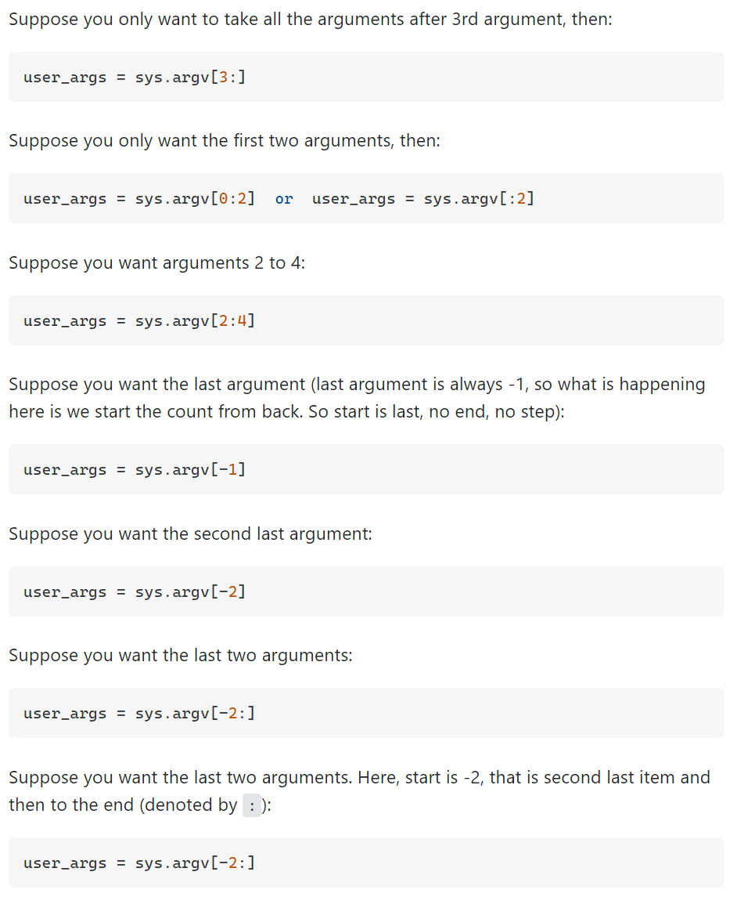

## Python Syntax
`since 2022.03.21.`

---

## Basic
> ### Print something
> print("something")
>
> ### Exit program with cmd
> exit()
> 
> ### Pass arguments with Command line
> 
> ```
> import sys
> 
> print 'Number of arguments:', len(sys.argv), 'arguments.'
> print 'Arguments list:', str(sys.argv)
> ```
> 
> Also can select the certain index of arguments to pass to main method from cli(sys.argv).
> 
> ### IntEnum Comparison 
> ```python
> from enum import Enum, IntEnum
> ...
> class ENUM(IntEnum):
>     ENUM-NAME = SOME-VALUE
> ...
> def send_to_server_result(self, test_file_path, INT-ARG):
>     if(INT-ARG != ENUM.ENUM-NAME):
>         DO-SOMETHING
>         return
> ```
