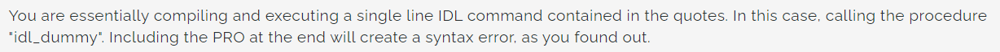

## [IDL, ENVI, SARscape] Problem & Solve

> ### [SOLVED] % Attempt to call undefined procedure: 'PSINSAR_PROCESS'.
> 
> **Problem** :: % Attempt to call undefined procedure: 'PSINSAR_PROCESS'.  
> **Solution** :: When execute idl .pro file with shell script, the extension '.pro' is already included so if try to execute with the command that like `idl -e FILENAME.pro` would syntax error occurred.
> So omit to the extension. Change from `shell_command = ["idl", "-e" "psinsar_process_test.sav.", "-args" ...]` to `shell_command = ["idl", "-e", "psinsar_senitnel1_test", "-args" ... ]`

