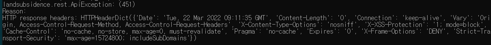

## [Java, HTTP] Problem & Solve

> ### [SOLVED] io.jsonwebtoken.security.WeakKeyException
>   
> **\# HttpStatus** : `500 (Internal Server Error)`  
> **\# Trace** : The specified key byte array is 248 bits which is not secure enough for any JWT HMAC-SHA algorithm.  The JWT JWA Specification (RFC 7518, Section 3.2) states that keys used with HMAC-SHA algorithms MUST have a size >= 256 bits.  
> **\# Cause** : The count of characters for secretKey that I generated was too short. If I choose `HS256` as Signature Algorithm, the bytes of secret key must be 256 bytes or larger then that. Also If I choose `HS512`, the secret key must be 512bytes or larger.        
> **\# Solution** : 1. Increase the secret key in `application.yml`. 2. change the Signature Algorithm from `HS512` to `HS256`.

> ### [SOLVED] HTTP Request has been succeeded, but the status code is 451
> 
>
> **Problem:** When I try to call API from client server to generate layer file into geoserver via python and IDL process,
> the HTTP request from client server has been succeeded, but got 451 HTTP status.  
> **Solution:** The request parameter of the API, multipart file(compressed, based on shapefile) occurred problem. The input, the path of targeted to compress files was incorrect, so the compressing process has been succeeded but the file was totaly empty. So the API of client server passed the empty file to geoserver and understandably they returned the response like the request was incorrect, with Http status code 451.
> like 'The request was incorrect'. So, I changed the statement to define the correct path of targeted- input files. Then It solved.  
