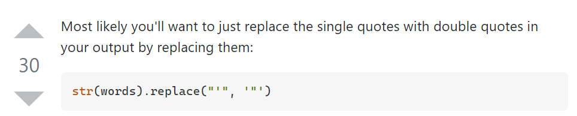
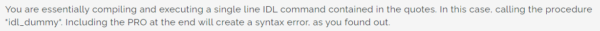
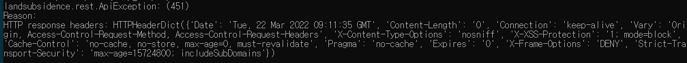
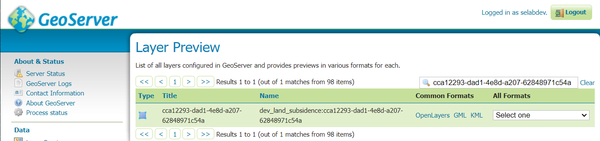

## Python, SARscape runner, ssh
`2022.03.21.-2022.03.24.`

---

## Task
* [x] fix the encoding to UTF-8
* [x] fix `% Attempt to call undefined procedure: 'PSINSAR_PROCESS'.`
* [x] Analyze the script, success to execute
* [x] Success to execute zip_shp.py
* [x] Fix HttpStatus 451
* [x] Success to upload result file and generate to geoserver layer

---

## Details

[ Run Python script ]
> python SCRIPT-NAME.py

[ Syntax ]

**== commands ==**

> ### Execute python file in cmd
> `python3 SCRIPT-NAME.py`

> ### Edit file with vim editor
> `vim SCRIPT-NAME.py`

> ### Save changes and quit vim editor
> press ESC, then type to `:wq!`

> ### Don't save changes and quit in vim
> press ESC, then type to `:q!`

> ### Install requirements
> pip3 install -r requirements.txt

> ### Execute bash shell script in cmd
> sh ./SCRIPT-FILENAME.sh
>
> ### Create file with cmd
> cat FILENAME.EXT

> ### Set line number on vim editor
> set nu

> ### Undo the type
> `u`

> ### Unzip compressed files
> unzip FILENAME.EXT

> ### Search domains
> dig

> ### Show executed commands history
> history

> ### Copy and transfer file via ssh*
> `scp [ACCOUNT-NAME]@[IP-ADDRESS]:[TARGET-PATH/TARGET-FILENAME] [LOCAL-DESTINATION-PATH(ABSOLUTE)]`  
> e.g.  
> `scp myaccount@100.100.100.100:/data/myaccount/landsubsidence/out/165/20220324103531/myfile.zip C:\Users\mylocalaccountname\Downloads`

**== Python ==**
> ### Print something
> print("something")

> ### Exit program with cmd
> exit()

---

## Issues & Problem solving
### SyntaxError: Non-ASCII character '\xeb' in file
> **Problem** :: * SyntaxError: Non-ASCII character '\xeb' in file  
> **Solution** :: open the file, add `# -*- coding: utf-8 -*-` on the first line, save then. Try to execute again.

### Python Syntax error (replace single quote to double quote)

> **Problem** :: The quote for replace is missing. `polygon_obj = eval(polygon_str.replace("'", ""))`  
> **Solution** :: Wrap the double quote with single quote to replace from single quote to double quote.   
> So change the statement to : `polygon_obj = eval(polygon_str.replace("'", '"'))`.


### % Attempt to call undefined procedure: 'PSINSAR_PROCESS'.

> **Problem** :: % Attempt to call undefined procedure: 'PSINSAR_PROCESS'.  
> **Solution** :: When execute idl .pro file with shell script, the extension '.pro' is already included so if try to execute with the command that like `idl -e FILENAME.pro` would syntax error occurred.
> So omit to the extension. Change from `shell_command = ["idl", "-e" "psinsar_process_test.sav.", "-args" ...]` to `shell_command = ["idl", "-e", "psinsar_senitnel1_test", "-args" ... ]`

### Comparison enum values in Python3
> **Problem**: Comparison enum values has been failed.    
> **Solution**: Explanation follows:
> ```python
> from enum import Enum, IntEnum
> ...
> class ENUM(IntEnum):
>     ENUM-NAME = SOME-VALUE
> ...
> def send_to_server_result(self, test_file_path, INT-ARG):
>     if(INT-ARG != ENUM.ENUM-NAME):
>         DO-SOMETHING
>         return
> ```

### HTTP Request has been succeeded, but the status code is 451
> 
> 
> **Problem:** When I try to call API from client server to generate layer file into geoserver via python and IDL process, 
> the HTTP request from client server has been succeeded, but got 451 HTTP status.  
> **Solution:** The request parameter of the API, multipart file(compressed, based on shapefile) occurred problem. The input, the path of targeted to compress files was incorrect, so the compressing process has been succeeded but the file was totaly empty. So the API of client server passed the empty file to geoserver and understandably they returned the response like the request was incorrect, with Http status code 451.
> like 'The request was incorrect'. So, I changed the statement to define the correct path of targeted- input files. Then It solved. 
> 
> 

---

## Remark

---

## Reference

[Omit to Extension when execute .pro file with shell script](https://www.l3harrisgeospatial.com/Support/Forums/aft/7058)  
[Python : I want to replace single quotes with double quotes in a list](https://stackoverflow.com/questions/42183479/i-want-to-replace-single-quotes-with-double-quotes-in-a-list)  
[Python : The Enum types in Python](https://brownbears.tistory.com/531)  
[SSH : Copy and Transfer file with ssh with scp](https://hyunsuk2.github.io/2018/01/16/ssh/)  

---
