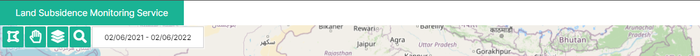
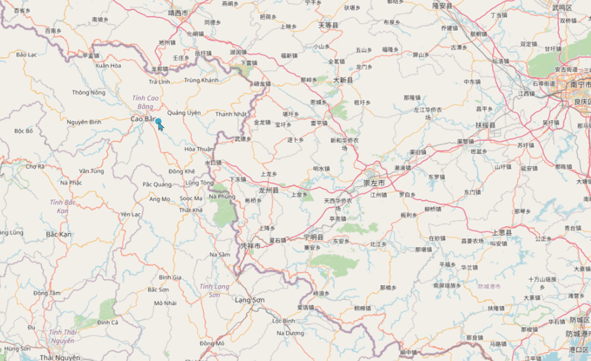

## Open Layer, JavaScript
`2022.03.25. - `

## Introduction
지반침하 모니터링 서비스 개발 프로젝트의 geoserver, open layer, bing map을 통한 Polygon 지역 범위 및 기간 선택의 UI/UX를 고도화하고, 사용자 편의를 개선하는 신규 기능을 추가한다.

---

## Task
* [x] 기존 4개 기능의 별도 버튼 표출 형식을 마우스 액션 방식으로 변경  
* [x] 기존 조회 기간 설정 기능을 마우스 액션 방식으로 변경
* [ ] 다각형 폴리곤 그리기 형식을 통한 지역 범위 선택 기능 추가
* [ ] 기타 사용자 UI/UX 개선
* [ ] 동남아 지반침하 관련 기사 크롤링 후 표출 기능 및 페이지 개발
* [ ] welcome 페이지 표출 기능 개발
* [ ] 완료 보고

---

## Details
### Task #1, #2   
  
Open Layer, JavaScript(ES6) 기반 지반침하 모니터링 데이터 조회를 위한 map 핸들링 기능을
기존 별도의 버튼 형식 표출에서 마우스 핸들링 기반으로 개선한다.  

팀원이 작성한 기존의 방식은 다음과 같이 class CustomControl을 별도로 선언 후, Open Layer의 control.Control을 상속한 constructor 내에서 
신규 div(custom-map-control ol-unselectable ol-control)및 map 핸들링을 위한 버튼을 createElement를 통해 생성하고,
click event를 각 버튼에 바인딩한 후  appendChild를 통해 자식 요소를 붙여주는 형식이다:

e.g.  
```javascript
class CustomControl extends ol.control.Control {
    custructor(opt_options) {
        ...
        const element = document.createElement('div');
        const childElement = document.createElement('button');
        ...
        element.appendChild(childElement);
        ...
        super({
            element: element, 
            target: options.target
        });
        
        childElement.addEventListener('click', 
            this.handleDrawPolygon.bind(this), false);
        
        handleDrawPolygon(){ ... }
        ...
    }
}

```

신규 요구사항은 다음과 같다:  
1. map 영역에 해당되는 기존 부모 요소인 element에 사용자의 마우스 포인터가 위치하면 polygon 그리기 기능을 활성화한다.  
2. 사용자가 지도 영역 내 polygon을 통한 영역 선택을 완료한 후, 별도의 버튼을 클릭하지 않고 영역 선택을 취소할 수 있어야 한다.  
3. 영역 선택이 완료되면, 사용자의 커서 위치에 따라 별도의 요소를 띄운 후 기간 선택 및 장바구니에 데이터 추가 기능을 지원한다.  
4. 기존 별도의 버튼 형식으로 지원되던 map 핸들링 UI는 삭제한다.

이에 따라, 기존 코드를 다음과 같이 변경한다:  
1. Open Layer를 통해 생성되는 canvas 전 영역이 클릭 이벤트 대상이므로 `document.onmouseenter` 함수를 작성한다.
2. 1의 mouseenter 이벤트가 활성화되면 open layer interaction을 생성한다.¹
3. 영역 선택 후 표출될 searchModal div를 생성하고, 기존 데이터 조회 버튼 및 조회 기간 설정 input을 append 한다.
4. searchModal의 position은 click eventdml clientX, clientY로 설정한다.
5. 선택 영역이 없는 경우 3의 searchModal을 removeChild()로 제거 처리한다.
6. 데이터 조회 버튼을 클릭하는 경우 클릭 이벤트가 발생하지 않게 하거나, searchModal을 제거 또는 숨김 처리한다.
7. 데이터 조회 기능이 실행될 때, searchModal을 숨김 처리 한 후, 조회가 완료되면 제거한다. 
8. 기존에 작성된 polygon 지역 선택 및 선택 취소 버튼을 삭제 처리한다.
9. 변경된 searchModal에 해당되는 css를 수정하고, 다국어 메세지(영어, 한국어, 베트남어)를 지원한다.


작성한 코드의 일부 내용은 다음과 같다:  
```javascript
...
document.onmouseenter=(e)=>{
    if(findOneLayerFromLayers('vectorLayer') !== undefined){
        const vectorLayer = findOneLayerFromLayers('vectorLayer');
        createInteraction(vectorLayer);
    }
}

const generateSearchModal=(e)=>{
    const searchModal = document.createElement('div');

    if(e !== undefined){
        searchModal.id = "searchModal";
        searchModal.style.left = (e.clientX - 300)+ "px";
        searchModal.style.top = (e.clientY) + "px";
    }
    return searchModal;
}

class CustomControl extends ol.control.Control {
    ...
    onclick = (e) => {
        const generatedSearchModal = document.getElementById("searchModal");
        const lastFeature = getLastFeature(findOneLayerFromLayers('vectorLayer'));

        if (lastFeature !== undefined
            && document.getElementById("searchModal") === null) {
            const searchModal = generateSearchModal(e);
            const modalTitle = document.createElement('h4')

            searchModal.style.display = "inline-block";
            modalTitle.textContent = localizationLanguages[userLanguage]['inquire within date'];
            dateInput.style.display = "inline-block";

            searchModal.appendChild(modalTitle);
            searchModal.appendChild(dateInput);
            searchModal.appendChild(addCartButton);
            element.appendChild(searchModal);
        } else if (lastFeature === undefined && generatedSearchModal !== null) {
            element.removeChild(generatedSearchModal);
        }
    }
    ...
}
...
```

완료 결과는 다음과 같다:  

---

## Issues & Problem solving
### Title
> 
>
> **Problem:**   
> **Solution:**   
>
> 

---

## Remark


---

## Reference


[reference-image](reference-image)  

---
