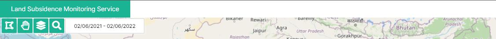
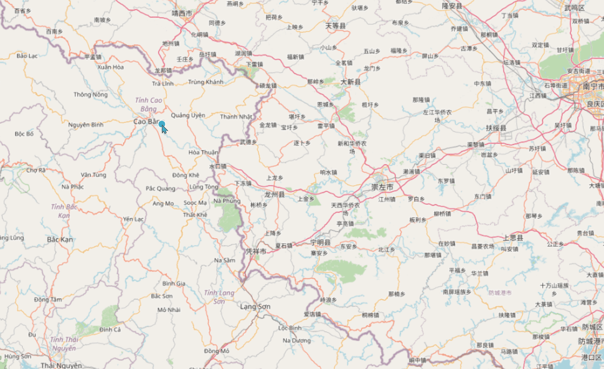
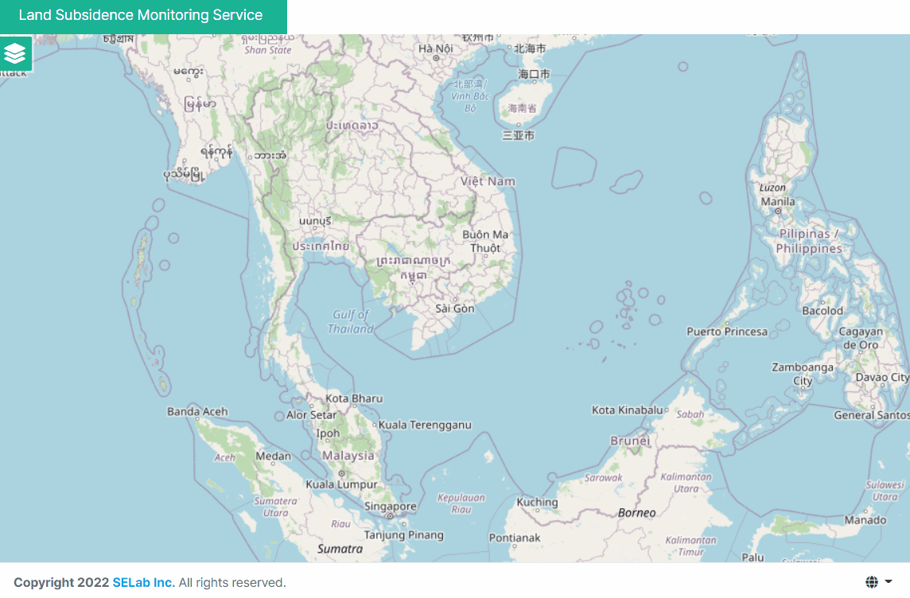
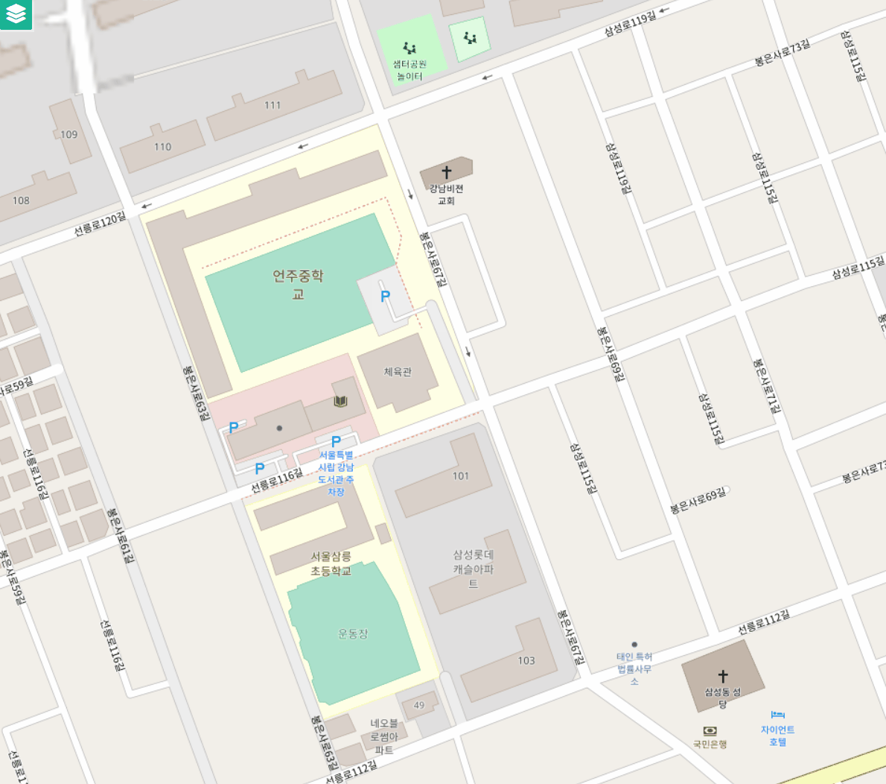
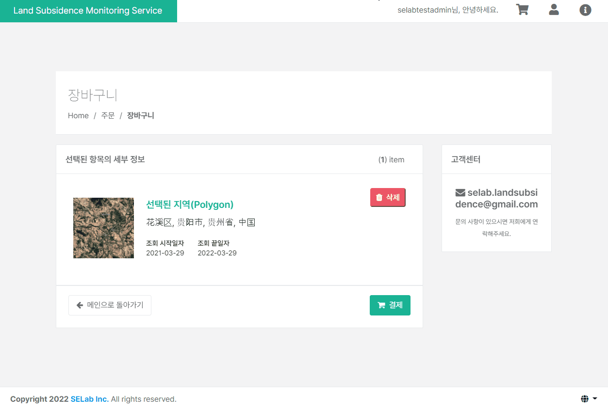

## Open Layers, JavaScript
`2022.03.25. - `

## Introduction
지반침하 모니터링 서비스 개발 프로젝트의 geoserver, Open Layers, bing map을 통한 Polygon 지역 범위 및 기간 선택의 UI/UX를 고도화하고, 사용자 편의를 개선하는 신규 기능을 추가한다.

---

## Task
* [x] 기존 4개 기능의 별도 버튼 표출 형식을 마우스 액션 방식으로 변경  
* [x] 기존 조회 기간 설정 기능을 마우스 액션 방식으로 변경
* [x] searchModal의 포지셔닝 예외 처리 조건문 추가
* [x] 다각형 폴리곤 그리기 형식을 통한 지역 범위 선택 기능 추가
* [x] 장바구니 내 항목 삭제, 삭제 이전 다국어-alert 표출 기능 개발
* [ ] 동남아 지반침하 관련 기사 크롤링 후 표출 기능 및 페이지 개발
* [ ] welcome 페이지 표출 기능 개발
* [ ] 완료 보고

---

## Details
### Task #1, #2   
  
Open Layer, JavaScript(ES6) 기반 지반침하 모니터링 데이터 조회를 위한 map 핸들링 기능을
기존 별도의 버튼 형식 표출에서 마우스 핸들링 기반으로 개선한다.  

팀원이 작성한 기존의 방식은 다음과 같이 class CustomControl을 별도로 선언 후, Open Layers의 control.Control을 상속한 constructor 내에서 
신규 div(custom-map-control ol-unselectable ol-control)및 map 핸들링을 위한 버튼을 createElement를 통해 생성하고,
click event를 각 버튼에 바인딩한 후  appendChild를 통해 자식 요소를 붙여주는 형식이다:

e.g.  
```javascript
class CustomControl extends ol.control.Control {
    custructor(opt_options) {
        ...
        const element = document.createElement('div');
        const childElement = document.createElement('button');
        ...
        element.appendChild(childElement);
        ...
        super({
            element: element, 
            target: options.target
        });
        
        childElement.addEventListener('click', 
            this.handleDrawPolygon.bind(this), false);
        
        handleDrawPolygon(){ ... }
        ...
    }
}

```

신규 요구사항은 다음과 같다:  
1. map 영역에 해당되는 기존 부모 요소인 element에 사용자의 마우스 포인터가 위치하면 polygon 그리기 기능을 활성화한다.  
2. 사용자가 지도 영역 내 polygon을 통한 영역 선택을 완료한 후, 별도의 버튼을 클릭하지 않고 영역 선택을 취소할 수 있어야 한다.  
3. 영역 선택이 완료되면, 사용자의 커서 위치에 따라 별도의 요소를 띄운 후 기간 선택 및 장바구니에 데이터 추가 기능을 지원한다.  
4. 기존 별도의 버튼 형식으로 지원되던 map 핸들링 UI는 삭제한다.

이에 따라, 기존 코드를 다음과 같이 변경한다:  
1. Open Layers를 통해 생성되는 canvas 전 영역이 클릭 이벤트 대상이므로 `document.onmouseenter` 함수를 작성한다.
2. 1의 mouseenter 이벤트가 활성화되면 Open Layers interaction을 생성한다.
3. 영역 선택 후 표출될 searchModal div를 생성하고, 기존 데이터 조회 버튼 및 조회 기간 설정 input을 append 한다.
4. searchModal의 position은 click eventdml clientX, clientY로 설정한다.
5. 선택 영역이 없는 경우 3의 searchModal을 removeChild()로 제거 처리한다.
6. 데이터 조회 버튼을 클릭하는 경우 클릭 이벤트가 발생하지 않게 하거나, searchModal을 제거 또는 숨김 처리한다.
7. 데이터 조회 기능이 실행될 때, searchModal을 숨김 처리 한 후, 조회가 완료되면 제거한다. 
8. 기존에 작성된 polygon 지역 선택 및 선택 취소 버튼을 삭제 처리한다.
9. 변경된 searchModal에 해당되는 css를 수정하고, 다국어 메세지(영어, 한국어, 베트남어)를 지원한다.


작성한 코드의 일부 내용은 다음과 같다:  
```javascript
...
document.onmouseenter=(e)=>{
    if(findOneLayerFromLayers('vectorLayer') !== undefined){
        const vectorLayer = findOneLayerFromLayers('vectorLayer');
        createInteraction(vectorLayer);
    }
}

const generateSearchModal=(e)=>{
    const searchModal = document.createElement('div');

    if(e !== undefined){
        searchModal.id = "searchModal";
        searchModal.style.left = (e.clientX - 300)+ "px";
        searchModal.style.top = (e.clientY) + "px";
    }
    return searchModal;
}

class CustomControl extends ol.control.Control {
    ...
    onclick = (e) => {
        const generatedSearchModal = document.getElementById("searchModal");
        const lastFeature = getLastFeature(findOneLayerFromLayers('vectorLayer'));

        if (lastFeature !== undefined
            && document.getElementById("searchModal") === null) {
            const searchModal = generateSearchModal(e);
            const modalTitle = document.createElement('h4')

            searchModal.style.display = "inline-block";
            modalTitle.textContent = localizationLanguages[userLanguage]['inquire within date'];
            dateInput.style.display = "inline-block";

            searchModal.appendChild(modalTitle);
            searchModal.appendChild(dateInput);
            searchModal.appendChild(addCartButton);
            element.appendChild(searchModal);
        } else if (lastFeature === undefined && generatedSearchModal !== null) {
            element.removeChild(generatedSearchModal);
        }
    }
    ...
}
...
```

완료 결과는 다음과 같다:  



---

### Task #3
신규 추가된 데이터 조회 기간 설정 및 장바구니 추가 modal은 사용자의 클릭 이벤트와 해당 커서의 클릭 위치에 따라
포지셔닝이 결정된다. 단, 사용자가 화면 외곽에 가까운 위치에서 지역을 선택하는 경우 해당 modal이 사용자 화면의 client-width
및 client-height을 넘어가는 경우가 존재할 수 있다. 이에 따라, 화면의 client-width/client-height에 따라 modal이 
위치할 수 있는 포지션의 최대/최소값을 설정 후 이 값 내에서 위치되도록 별도의 예외 처리가 요구된다. 


따라서, 해당 요소의 포지셔닝을 결정하는 함수 generateSearchModal을 다음과 같이 수정하였다:  

```javascript
const generateSearchModal=(e, parent)=>{
    const searchModal = document.createElement('div');
    let background = parent.parentElement;
    let backgroundWidth = background.getBoundingClientRect().width;
    let backgroundHeight = background.getBoundingClientRect().height;

    if(e !== undefined){
        searchModal.id = "searchModal";
        if(e.clientX < 300) { searchModal.style.left = 20 + "px"; }
        else if(e.clientX > (backgroundWidth - 300)) { searchModal.style.left = (backgroundWidth - 300) + "px"; }
        else { searchModal.style.left = (e.clientX - 300)+ "px"; }

        if(e.clientY < 240) { searchModal.style.top = 20 + "px"; }
        else if(e.clientY > (backgroundHeight - 240)) { searchModal.style.top = (backgroundHeight - 240) + "px"; }
        else { searchModal.style.top = (e.clientY) + "px"; }
    }
    return searchModal;
}
```

완료 결과는 다음과 같다:  



---

### Task #4
기존 직사각형의 polygon 지역 선택 방식에서 사용자 정의 polygon(다각형) 그리기를 통한 지역 선택 방식으로 변경한다.  

```javascript
const createInteraction = (vectorLayer) => {
    const value = 'Circle';
    const draw = new ol.interaction.Draw({
        source: vectorLayer.getSource(),
        type: value, 
        geometryFunction: ol.interaction.Draw.createBox(),
    });
    draw.on('drawstart', removePreviousDraw);
    draw.set('id', 'drawPolygon');

    removeDuplicateInteractionById('drawPolygon');
    map.addInteraction(draw);
}
```
변경은 매우 쉽다. 위의 코드를 다음과 같이 변경해 준다:   
변경점은 `const value`의 값, 그리고 `geometryFunction`의 제거 단 둘 뿐이다.  

```javascript
const createInteraction = (vectorLayer) => {
    const value = 'Polygon';
    const draw = new ol.interaction.Draw({
        source: vectorLayer.getSource(),
        type: value
    });
    draw.on('drawstart', removePreviousDraw);
    draw.set('id', 'drawPolygon');

    removeDuplicateInteractionById('drawPolygon');
    map.addInteraction(draw);
}
```

완료 결과는 다음과 같다:  



---

### Task #5
장바구니 내 항목 삭제 기능을 신규로 개발하고, 삭제 기능을 실행하기 전 사용자에게 다국어 지원을 추가한 alert를 띄우도록 한다.  
장바구니 내 항목은 cookie를 통해 저장되어 있으며, 장바구니 화면 표출 시 각 항목에 대응되는 쿠키의 값을 가져와 표출하고 있다.  
알림은 웹 페이지 내 범용적으로 사용되고 있는 SweetAlert2로 작성한다.

작성 된 코드는 다음과 같다:  

```javascript
let localizationLanguages = alertLanguage;

const deleteSelectedInCart=()=>{
    let lang = getCookieValue("lang");
    
    swal.fire({
        text: localizationLanguages[lang]['would delete'],
        icon: 'error',
        showCancelButton: true,
        confirmButtonText: localizationLanguages[lang]['yes'],
        cancelButtonText: localizationLanguages[lang]['no'],
        confirmButtonColor: '#f27474',
    }).then((res)=>{
        if(res.isConfirmed) {
            removeCookies();
            document.location.reload(true);
        }
    });

    const targetCookieNames =
        ["userId", "polygon", "startDate", "endDate", "cost", "coordinates", "locationName"];

    removeCookies=()=>{
        for(let i = 0; i < targetCookieNames.length; i++ ){
            if(targetCookieNames[i] != null){
                removeCookie(targetCookieNames[i]);
            }
        }
    }
}
```

1. 쿠키 삭제는 `removeCookies()` 함수를 통해 실행된다. 대상이 되는 쿠키의 명칭들을 배열로 선언하고, 선언된
쿠키들을 반복문을 통해 지우는 방식이다. 단, 해당되는 쿠키가 존재하는 경우에만 삭제를 진행한다.  

2. 알림은 swal(SweetAlert2)를 통해 실행되고, HTML 내 신규 추가한 버튼의 onclick 이벤트로 실행된다. 즉, 사용자가
항목 삭제 버튼을 클릭하면 알림을 먼저 띄운 후, response(`res`)가 confirmed인 경우에만 쿠키 삭제를 실행한다. 
사용자가 삭제 버튼을 잘못 눌렀거나, 삭제 의사를 취소하는 경우가 발생할 수 있으므로 해당 알림창은 confirm/cancel 
두 가지 버튼을 포함하도록 한다. 또한, 삭제가 완료되면 장바구니 페이지를 한 번 새로고침 하여 장바구니 내 항목이
삭제되었음을 사용자가 바로 확인할 수 있도록 한다.   

3. 알림창의 다국어 지원은 별도의 js 파일로 작성한 `const alertLanguage@language.js` 의 함수에 의해 각 언어별 
올바른 문구가 대입되도록 한다. 사용자의 언어 판별 여부는 마찬가지로 쿠키 `lang`(kr, en, vi) 항목으로 대입되어 있다.  
`language.js` 파일에서의 `const alertLanguage` 구조는 다음과 같다:  

```javascript
const alertLanguage={
    'en': {
        'yes': 'Yes',
        'no' : 'No'
    },
    'ko': {
        'yes': '네',
        'no' : '아니오'
    },
    'vi': {
        'yes': 'Vâng',
        'no' : 'Dạ không'
    }
}
```

완료 결과는 다음과 같다:  




---

## Issues & Problem solving
### Title
> 
>
> **Problem:**   
> **Solution:**   
>
> 

---

## Remark


---

## Reference

[Mozilla - web docs : Node.parentElement](https://developer.mozilla.org/en-US/docs/Web/API/Node/parentElement)  
[Open Layers Polygon feature example](https://plnkr.co/edit/iI92XbxVDAg97MNQt5JV?p=preview&preview)  
[Official Document : Sweet Alert 2](https://sweetalert2.github.io/)  

---
