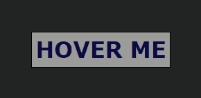

## 사이트 전반 UI UX 개선 및 컬러칩 변경
`2022.03.30. - 2022.04.01.`

## Introduction
지반침하 모니터링 서비스 개발 프로젝트의 UI/UX를 개선하고, 컬러칩을 변경한다.

---

## Task
* [x] header, footer의 버튼 hover 이펙트 추가를 통한 사용자 편의성 개선
* [x] Inspinia 기본 테마에서 사이트 전반 컬러칩 변경

---

## Details
### Task #1
사용자의 사이트 이용 편의성을 개선하기 위해서, Navigation bar 및 Footer의 아이콘 메뉴를 hover 할 때 
해당 메뉴의 명칭을 표시하는 css 효과를 추가한다.

예를 들면, 이런 식으로 작성하면 된다:  
```html
<html>
    <head>
        <style>
            :root {
                --magenta: #aa0144;
                --teal: #045d5d;
                --golden: #df7701;
                --navy: #0b0b45;
                --deep-dark: #181a19;
                --dark: #222423;
                --medium: #757164;
                --light: #9b9b98;
                --super-light: #fbfbf8;
            }

            body { background-color: var(--dark); padding: 2rem; }
            * { transition: all 1s; font-weight: 600; font-family: Verdana, sans-serif; }
            a:hover p { display: none; }
            a:hover span { display: block; }

            a { text-decoration: none; color: inherit;  font-size: 1.6rem; }
            p, span { fit-content; padding: 4px; }
            p { display: block; color: var(--navy); background-color: var(--light); }
            span { display: none; background-color: var(--navy); color: var(--light); }
        </style>
    </head>
    <body>
        <div class="top-navigation">
            <a href="/">
                <p class="icon"> HOVER ME </p>
                <span class="some-text">SOME TEXT</span>
            </a>
        </div>
    </body>
</html>
```

결과는 이런 식으로 표출된다:  




즉, 다음과 같은 HTML이 있다면:  
1. 기본 값은 icon을 보여주고, p 태그 내 본문은 노출시키지 않도록 한다.  
2. 부모 개체인 a를 hover 하면 i 태그는 감추고, p 태그는 보여주도록 한다.
3. 끝이다!

```html
<div class="top-navigation">
    <a href="/some-link">
        <i class="fas fa-some-icon"/>
        <p class="some-text">SOME TEXT</p>
    </a>
</div>
```

```css
i { display: block; }
p { display: none; }
a:hover i { display: none; }
a:hover p { display: block; }
```


완료 결과는 다음과 같다:  


---

### Task #2
기존 사내에서 유료로 결제한 Inspinia 기본 테마의 색상 및 디자인에 대한 불만족이 있어, 사이트 전반적인 컬러칩 및 디자인을 개선하기로 한다. 
단, 반응형 사이트임을 벗어나서는 안 되고, 기본적인 레이아웃 및 색상, 구성 정도만 갈무리하여 일종의 탬플릿과 같은 통일된 구조를 유지하기로 한다. 
지극히 개인적인 취향으로, 라이트 모드... 온통 흰색... 그리고 ... 요상한 목욕탕 초록색의 Inspinia default primary 색상...?  
극혐입니다....   
^^


여튼, 통일성 있는 디자인을 유지하기 위해 컬러칩은 변수 형식으로 선언한다:  
이렇게 작성하면, 나중에 디자인이 변경되어도 root에 선언한 저 hex 코드의 값만 바꾸면 마술처럼 모든 대입처에 적용된다.  
```css
:root {
    --magenta: #aa0144;
    --teal: #045d5d;
    --golden: #df7701;
    --navy: #0b0b45;
    --deep-dark: #181a19;
    --dark: #222423;
    --medium: #757164;
    --light: #9b9b98;
    --super-light: #fbfbf8;
}
```

사용할 때는 이런 식으로 한다:  
```html
<p style="color: var(--navy)">안녕하세요.</p>
```

기본적인 색상 배치는 이런 식으로, 2종의 강조 색상(--navy, --super-light)과 본문 및 배경 색상 등을 어느 정도 통일성 있는 범위 안에서 명도별 차이를 둔다. 
사실 이 작업은 약간의 노가다로, 크게 어려운 부분은 없다.  


완료 결과는 다음과 같다:  
  


---

## Remark

---

## Reference
[Stackoverflow : Change text on hover, then return to the previous text](https://stackoverflow.com/questions/9913293/change-text-on-hover-then-return-to-the-previous-text)

---
