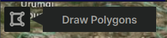
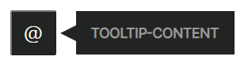
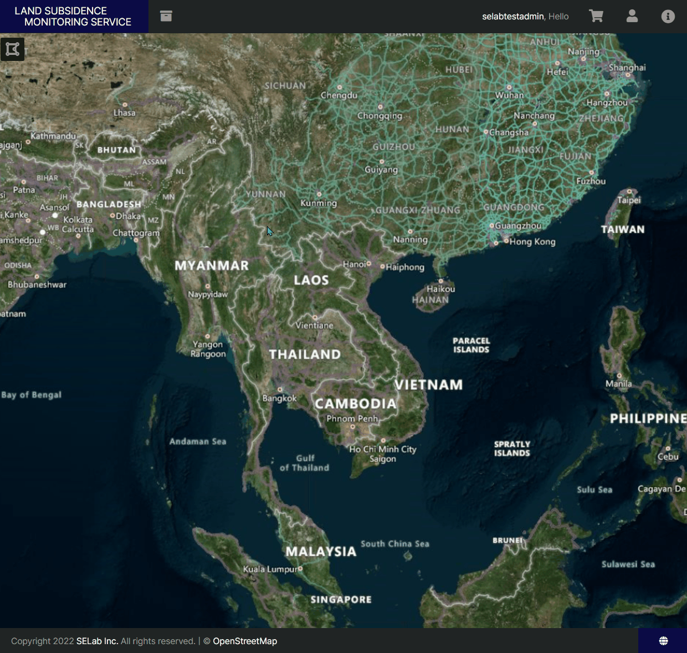

## UI-UX Development(2), Open Layers
`2022.04.04. - 2022.04.05.`

## Introduction
지반침하 모니터링 서비스 개발 프로젝트의 폴리곤 그리기 기능을 별도의 버튼으로 생성, 바인딩하고 표출 시스템의 UI/UX를 개선한다.

---

## Task
* [x] welcome 페이지 접근 핸들링 기능 추가
* [x] 폴리곤 그리기 기능을 별도의 버튼으로 생성 후 토글 형식으로 그리기 기능 바인딩

---

## Details
### Task #1
작성한 임의의 welcome 페이지의 1회성 접근을 쿠키를 통해 핸들링한다. 현재 사용자가 회원 계정으로 로그인하지 않은 경우, 
동시에 welcome 페이지 접근을 통해 생성된 쿠키 `visitedWelcome`를 브라우저에 가지고 있지 않은 경우에 한 해 표출하도록 한다.
사용자가 welcome 페이지에 재접근을 원하는 경우는 header의 info 메뉴를 클릭해서 접근할 수 있도록 한다.  


1. 먼저, 아래와 같이 HTML 내 버튼을 생성하고, 쿠키 생성 및 경로 이동 함수를 생성해 onclick 이벤트로 붙여준다.
2. welcome 페이지에서 해당 버튼을 클릭하면 쿠키를 생성하고, 메인 페이지로 이동한다.
3. `/` 경로의 controller 매핑 메소드에서 현재 로그인 중인 사용자이거나, welcome 페이지를 경유해 생성한 쿠키가 있는지 검사한다.
4. 3의 조건문이 충족되면: 즉, 로그인 중인 사용자이거나 welcome 페이지에서 go to main as guest 버튼을 클릭한 적 있다면 index로 보낸다.
5. 3의 조건문이 충족되지 않으면: 즉, 비회원이며 welcome 페이지에서 go to main as guest 버튼을 클릭하지 않았다면 welcome 페이지로 보낸다.
6. 추후 재방문을 원하는 회원 또는 welcome 페이지의 방문 기록이 있는 비회원을 위해 navbar의 info 탭에 welcome 경로를 매핑해 둔다.
7. 마지막으로, 비로그인 사용자의 방문을 spring security가 막지 않도록 `/welcome` 경로를 permit 처리하는 것을 잊지 않는다.

정리하면:  
1. 다음과 같은 HTML 버튼을 생성하고,  
```html
<button class="btn btn-primary" onclick="goMainAsGuest()">
    <span th:text="#{go-to-main}"></span>
</button>
```

2. 쿠키 생성 및 경로 이동 함수를 생성 후 onclick으로 붙이고,  
```javascript
goMainAsGuest=()=>{
    generateCookie("visitedWelcome", "1");
    window.location.href = "/";
}

generateCookie=(cookieName, cookieValue)=>{ 
    document.cookie = encodeURIComponent(cookieName) + "=" + encodeURIComponent(cookieValue); 
}
```

3. 쿠키 존재 및 로그인 여부에 따라 `/` 경로의 매핑 페이지를 다르게 하며,  
```java
@RequestMapping("/")
public String index(
        Model model, HttpServletResponse response, @CurrentUser UserPrincipal currentUser, HttpServletRequest httpRequest,
        @RequestParam(value = "page", required = false, defaultValue = DEFAULT_PAGE_NUMBER) Integer page,
        @RequestParam(value = "size", required = false, defaultValue = "3") Integer size
    ) {
        ...
        return dependOnIsVisitedWelcome(currentUser, httpRequest);
        }

    public String dependOnIsVisitedWelcome(@CurrentUser UserPrincipal currentUser, HttpServletRequest httpRequest) {
        if(currentUser != null || getCookieValue(httpRequest, "visitedWelcome").equals("1")){
            return "index";
        } else { return "welcome"; }
    }
```

4. Navbar의 info 탭 dropdown에 경로를 매핑 해 둔다.
```html
<li class="dropdown" style="height: 60px;">
    <a th:href="@{/welcome}" class="nav-link" style="padding: 20px 14px; height: 54px; color: var(--light);">
        <i class="fas fa-info-circle" style="font-size: 1.4em"></i>
        <p th:text="#{info.title}"></p>
    </a>
</li>
```

5. Spring security에 `/welcome` 경로의 방문을 비인증 사용자도 가능하도록 허용해 둔다.
```java
    private static final String[] AUTH_WHITELIST = {
        ... 
        "/welcome"
    };

@Override
protected void configure(HttpSecurity http) throws Exception{
        http.authorizeRequests()
        .antMatchers(AUTH_WHITELIST).permitAll()
        ...
}
```


완료 결과는 다음과 같다:  


---

### Task #2
클릭 이벤트를 통한 폴리곤 그리기 및 취소 핸들링 이벤트를 작성하고, 적용하였으나 다시 별도의 버튼으로 해당 기능을 바인딩하는 요구사항을 전달 받았다. 
단, 이 새로운 폴리곤 그리기/그리기 취소 버튼은 toggle 형식으로 작동하도록 하고, 사용자 편의를 고려하여 [새로 그리기] 및 hover 효과를 추가하기로 한다.


우선 토글 형식의 버튼부터 만들어 본다.  
원리는 간단하다. 사용자가 해당 버튼을 클릭할 때마다 `let count`에 후위연산자를 붙여 count 수를 1씩 증가시키고, 
이 수를 2로 나누었을 때 나머지가 0인 경우는 2회째 클릭, 즉 폴리곤 그리기 취소 기능과 매핑되어야 할 것이다. 
즉 이렇게 된다:  

버튼 1회 클릭 : [폴리곤 그리기 기능 활성화]   
버튼 2회 클릭 : [폴리곤 그리기 기능 비활성화]  
버튼 3회 클릭 : [폴리곤 그리기 기능 활성화]  
...

단순 기능 매핑 뿐만 아니라, 보다 직관적인 사용자 경험을 위해 활성화된 기능에 따라 버튼의 색상 등을 바꾸도록 해본다.  
또한, 버튼을 hover하는 경우, 해당 버튼에 매핑된 기능을 tooltip을 통해 노출시켜준다.  
즉 HTML은 이런 형태로 작성되어야 한다 :  

```html
<div class="outermost-element">
    <div class="wrapper-element">
        <button class="polygonHanding">
            <div class="temp-icon">＠</div>
        </button>
        <div class="shape"></div>
        <span class="tooltip">TOOLTIP-CONTENT</span>
    </div>
</div>
```



위의 HTML을 아래 이미지와 같이 깎아보자.  
CSS는 이렇게 작성한다 :  

```css
:root {     
    --magenta: #aa0144;
    --teal: #045d5d;
    --golden: #df7701;
    --navy: #0b0b45;
    --deep-dark: #181a19;
    --dark: #222423;
    --medium: #757164;
    --light: #9b9b98;
    --super-light: #fbfbf8;
}
.shape { 
    width: 0;
    height: 0;
    border-top: 8px solid transparent;
    border-right: 16px solid var(--dark);
    border-bottom: 8px solid transparent;
    margin-top: 19px;
    display: inline-block;
}
.tooltip {
    background: var(--dark);
    color: var(--light);
    height: 34px;
    font-size: 0.9rem;
    padding: 5px;
    font-weight: 600;
    position: absolute;
    width: 150px;
    text-align: center;
    vertical-align: middle;
    font-family: sans-serif;
    line-height: 2.1rem;
    margin-top: 5px;
}
button {
    width: 46px;
    height: 46px;
    background: var(--dark);
    color: var(--super-light);
    border-radius: 2px;
}
button > div { 
    font-size: 1.3rem;
}
```

  

여기에 기능을 매핑한다.  

1. drawPolygonToggle에 `changeModeToDrawPolygon`을 바인딩 해 둔다.
2. drawPolygonToggle의 클릭 횟수를 `let count`에 더한다.
3. 2의 클릭 횟수가 2로 나누었을 때 나머지가 없으면(즉, 2의 배수이면) `changeModeToStopDrawPolygon`를 바인딩 후 1의 이벤트의 바인딩을 해제한다.


```javascript
...
drawPolygonToggle.addEventListener('click', this.handleMapPolygon.bind(this), false);

let count = 0;
drawPolygonToggle.onclick=()=>{
    count += 1;
    if(count % 2 === 0){
        this.changePolygonButtonToDark(drawPolygonToggle, drawPolygonIcon, polygonHandingTooltip);
        this.handleFinishDraw();
        drawPolygonToggle.removeEventListener('click', this.changeModeToDrawPolygon.bind(this), false);
    } else {
        this.changePolygonButtonToLight(drawPolygonToggle, drawPolygonIcon, polygonHandingTooltip);
    }
}
...
changeModeToDrawPolygon() {
    if(findOneLayerFromLayers('vectorLayer') !== undefined){
        const vectorLayer = findOneLayerFromLayers('vectorLayer');
        createInteraction(vectorLayer);
    }
}
changeModeToStopDrawPolygon() {
    removeDuplicateInteractionById('drawPolygon');
}

```

부가적으로, 보다 직관적인 사용자 경험을 위해 해당 버튼에 바인딩 된 기능에 따라 버튼의 색상과 툴팁의 문구도 변경하도록 했다.  

```javascript
changePolygonButtonToLight=(button, icon, tooltip)=>{
    button.style.backgroundColor = 'var(--light)';
    icon.style.color = 'var(--navy)';
    tooltip.textContent = localizationLanguages[userLanguage]['Stop Draw Polygon'];
}

changePolygonButtonToDark=(button, icon, tooltip)=>{
    button.style.backgroundColor = 'var(--deep-dark)';
    icon.style.color = 'var(--light)';
    tooltip.textContent = localizationLanguages[userLanguage]['Draw Polygon'];
}
```

완료 결과는 다음과 같다:  
회색으로 변한 버튼을 클릭한다면, 마우스 커서의 파란 동그라미(폴리곤 그리기 기능이 활성화 된 상태)가 사라지는 것을 볼 수 있다.  



---

## Remark

---

## Reference

---
