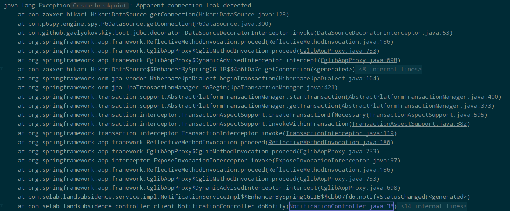

## SSE(Server Sent Event) connection 누수, JPA 리팩토링
`2022.04.06. -`

## Introduction
기존 지반침하 프로젝트에서 과도한 트랜젝션이 발생하여 HikariCP Connection Timeout(Deadlock)이 발생하는 이슈를 확인하고, 원인을 해결한다.

---

## Task
* [x] HikariCP Connection Timeout 원인 파악
* [x] SSE Emitter의 발송 완료/에러 발생한 emit close 처리
* [x] JPA 로직 전반 불필요한 트랜젝션 발생 로직 리팩토링
---

## Details
### Task #1, #2
프로젝트에 주기적으로 HikariCP Connection Timeout이 발생하는 것을 확인하였다.  
먼저, 해당 이슈의 원인을 파악하도록 한다.

레퍼런스로 참고한 [HikariCP Dead lock에서 벗어나기 (실전편)](https://techblog.woowahan.com/2663/) 페이지에서는 원인을 찾기 위해, 
`hikari:leak-detection-threshold`를 선언할 수 있다고 명시 해 두었다. 직접 한번 작성해보자 :  

```properties
spring.datasource.hikari.leak-detection-threshold=2000
spring.datasource.hikari.connection-test-query=SELECT 1 FROM DUAL
```

  

돌려보니 바로 잡힌다.   
**명백한 누수가 감지됨(Apparent connection leak detected).**  
원인은 SSE(Server Sent Event) 실시간 알림 메시지의 발송이 완료한 후에도 complete(close) 처리를 하지 않았기 때문이었다.  


아래의 코드에 다음과 같이 2줄을 추가해 준다.

```java
final List<SseEmitter> emitters = new CopyOnWriteArrayList<>();

@Override
@Transactional
public void notifyStatusChanged(HttpServletRequest httpRequest, StatusChangeRequest request) {
    request.setMessage(i18nMessage(httpRequest, request));
    List<SseEmitter> deadEmitters = new ArrayList<>();

    if(request.getPaidDataId() != null){
        notificationRepository.save(notificationBuilder(httpRequest, request));
        emitters.forEach(emitter -> {
            try {
                emitter.send(SseEmitter.event().data(request.getMessage()));
                emitter.complete(); // 발송 후 complete 처리
            }
            catch (Exception e) {
                deadEmitters.add(emitter);
                emitter.completeWithError(e);  // 에러 발생시 complete 처리 및 throw error
            } 
        });
    }
    emitters.removeAll(deadEmitters);
}
```

SSE initialize를 위해 작성한 controller 내 구문에도 다음과 같이 complete 구문을 추가해준다 :  

```java
private final ExecutorService executor = Executors.newCachedThreadPool();

@GetMapping(value = "/notification", produces = "text/event-stream")
public ResponseEntity<SseEmitter> doNotify(HttpServletRequest httpRequest, StatusChangeRequest request) throws Exception {
    notificationService.notifyStatusChanged(httpRequest, request);
    return new ResponseEntity<>(initializeSSE(), HttpStatus.OK);
}

public SseEmitter initializeSSE() throws Exception {
    SseEmitter emitter = new SseEmitter(Long.MAX_VALUE);
    executor.execute(() -> {
        try{
            emitter.send(SseEmitter.event().name("connected"));
            notificationService.addEmitter(emitter);
            emitter.onCompletion(() -> notificationService.removeEmitter(emitter));
        } catch(Exception e){
            log.error("Error while sending SSE for connection : caused by : {}", e.getMessage());
            emitter.completeWithError(e); // 에러 발생시 complete 처리 및 throw error
        }
        emitter.onTimeout(() -> notificationService.removeEmitter(emitter));
    });
    return emitter;
}
```

더이상 누수가 발생하지 않는지 확인해 보자.  
hikari maximum-pool-size를 1로 잡고 서버를 재시작 해 보면 connection 누수가 해결되었음을 확인할 수 있다.  

```properties
spring.datasource.hikari.maximum-pool-size=1
```


---

### Task #3
과도한 트랜젝션의 발생 원인을 파헤치는 과정에서, SSE 자원 반납 이슈 외에도 일부 JPA 로직이 불필요한 트랜젝션을 발생시키고 있음을 확인하였다.   
이를테면, 이런 경우이다 :   

**Controller**
```java
@RequestMapping("/")
public String index(
        Model model, @CurrentUser UserPrincipal currentUser, 
        HttpServletRequest httpRequest, HttpServletResponse response,
        @RequestParam(value = "page", required = false, defaultValue = DEFAULT_PAGE_NUMBER) Integer page,
        @RequestParam(value = "size", required = false, defaultValue = "3") Integer size
    ) {
    if(currentUser != null){ // 이 조건문 내 로직에 주목하세요
        Long userId = userRepository.getUserByEmail(currentUser.getEmail()).getId();
        createCookie(response, "userId", userId.toString());
        model.addAttribute("allPaidData", paidDataService.getAllPaidDataByUserEmail(currentUser.getEmail(), page, size));
    }
    return dependOnIsVisitedWelcome(currentUser, httpRequest);
}
```


**ServiceImpl**
```java
@Override
public Page<PaidData> getAllPaidDataByUserEmail(String email, int page, int size) {
    pageValidation(page, size);
    User user = userRepository.getUserByEmail(email);
    return paidDataRepository.findAllByUserId(user.getId(), sortDescending(page, size));
}
```

어떤 문제가 있는지 확인했는가?   
우선 index 페이지의 전반적인 플로우는 다음과 같다 :  

1. index 페이지에 접속한 사용자가 회원인지, 비회원인지 분간한다 : `if(currentUser != null)`
2. **회원인 경우**, custom user Principal인 **@CurrentUser로부터 이메일을 가져와서 회원 id를 조회한다.** (트랜젝션 발생)
3. 가져온 id로 해당 회원이 결제된 데이터(PaidData)를 가지고 있는지 조회하기 위해 **email을 인자로 던진다.** 
4. **인자로 받은 email로 회원 조회를 또 한다!** (트랜젝션 발생)
5. 3-2에서 **조회된 회원의 아이디로** 결제 내역을 조회해서 리턴한다. (트랜젝션 발생)

이미 로그인 중인 회원의 결제 내역을 조회하는 데에만 트랜젝션이 3번이나 발생한다!  

위의 플로우는 다음과 같이 축약할 수 있을 것이다 :  
1. index 페이지에 접속한 사용자가 회원인지, 비회원인지 분간한다.
2. 회원인 경우, @CurrentUser로부터 이메일을 가져와서 결제내역 조회 로직으로 던진다.
3. **받은 이메일로 결제 내역을 조회해서 리턴한다.** (트랜젝션 발생)

위의 플로우로 리팩토링한다면 트랜젝션은 단 1번이면 된다.  
즉, 코드는 이렇게 변경되어야 할 것이다 :  

**Controller**  
```java
@RequestMapping("/")
public String index(
        Model model, @CurrentUser UserPrincipal currentUser,
        HttpServletRequest httpRequest, HttpServletResponse response,
        @RequestParam(value = "page", required = false, defaultValue = DEFAULT_PAGE_NUMBER) Integer page,
        @RequestParam(value = "size", required = false, defaultValue = "3") Integer size
        ) {
    if(currentUser != null){
        long userId = currentUser.getId();
        createCookie(response, "userId", String.valueOf(userId));
        model.addAttribute("allPaidData", paidDataService.getAllPaidDataByUserId(userId, page, size));
    }
    return dependOnIsVisitedWelcome(currentUser, httpRequest);
}
```

**ServiceImpl**  
```java
@Override
public Page<PaidData> getAllPaidDataByUserId(long id, int page, int size) {
    pageValidation(page, size);
    return paidDataRepository.findAllByUserId(id, sortDescending(page, size));
}
```


---

## Remark

---

## Reference

[HikariCP Dead lock에서 벗어나기 (실전편)](https://techblog.woowahan.com/2663/)

---
