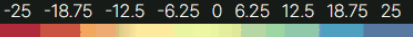
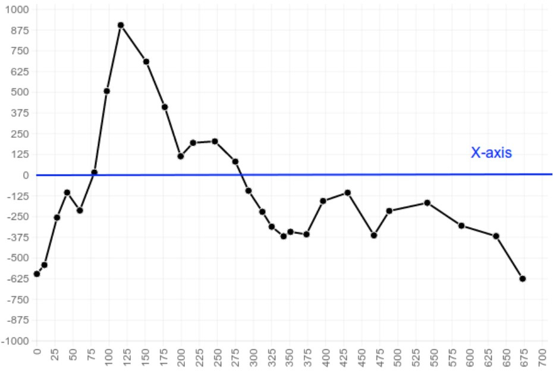

## Chart.js 결과 표출 차트 고도화
`2022.04.07. - 2022.04.11.`

## Introduction
지반침하 모니터링 서비스 개발 프로젝트의 결과 표출 차트를 신규 요구사항에 맞게 변경하고, 변경된 컬러칩 및 스타일을 반영한다.

---

## Task
* [x] 결과 표출 차트의 스타일 및 포지션 변경
* [x] 차트 닫기 버튼, 제목, 컬러링 범위 표기 요소의 신규 추가 및 포지셔닝
* [x] 결과 페이지 내 이동 시 차트 제거 처리
* [x] 차트의 x-axis 0에 horizontal line 추가 및 지반 침하/상승의 색상 분리
* [x] 기존 line 타입 차트를 line + bar combo로 변경
---

## Details
기존의 차트는 결과 데이터를 표출하기 위해 팀원이 작성한 것으로, 차트 닫기 버튼, 수치 범위에 따른 각 포인트 색상 대입 표기,
차트 제목 등이 대입되어 있지 않아 추가적인 작업이 필요하였다. 또한 신규로 변경된 사이트 전반의 디자인 및 색상 등의 대입, 신규로
요구되는 차트의 형식 변환 등이 요구되어 관련 작업을 수행하였다.


우선, 기존의 결과값 차트는 다음과 같이 데이터를 표출하고 있었다:


위와 같은 방식의 표출은 다음과 같은 개선점을 가진다:
1. 차트의 포지션은 헤더로부터 top 4em, left 1em의 고정값으로 설정되어 사용자 시점에서 포인트를 선택하기에 불편하다.
2. 차트의 전반적인 색상이 사이트 전반의 색상과 일치하지 않아 통일성이 떨어진다.
3. 차트 닫기 버튼이 존재하지 않아, 차트를 닫을 수 있는 방법이 존재하지 않는다.
4. 차트의 제목이 표시되지 않는다.  
5. 각 포인트를 클릭했을 때 표출되는 데이터는 지반의 침하 또는 상승을 의미하나, 이 두 경우에 대한 색상 분리가 되어 있지 않아 식별성이 떨어진다.  
6. 수치 범위에 따른 각 포인트의 색상 대입 기준이 명시되어 있지 않아 정확한 수치 파악이 어렵다.  
7. 기존 line 타입 차트에서 bar + line combo 형식으로의 변경이 신규로 요구되었다.  


따라서, 위에 명시한 사항들은 다음과 같이 개선되어야 할 것이다:  
1. 반응형 기준에 맞춰 사용자가 포인트를 선택할 때 거슬림이 없도록 차트의 포지션을 변경한다.
2. 차트의 전반적인 색상 및 UI를 사이트 전반의 신규 컬러칩 및 폰트, 스타일에 맞춰 통일된 디자인으로 변경한다.  
3. 차트 닫기 버튼을 추가하고, 새로운 결과 데이터를 선택하는 경우 이전 데이터의 차트를 자동으로 닫도록 한다.
4. 차트의 제목을 추가하고 다국어(영어, 베트남어, 한국어)를 지원하도록 한다.
5. 데이터 0을 기준으로 차트의 값 표출 색상을 분리하여 지반의 침하 또는 상승을 직관적으로 식별할 수 있도록 한다.
6. 수치 범위에 따른 색상 대입 기준을 gradient bar 등의 형식으로 별도 표기하도록 한다.
7. 차트의 표출 형식을 bar + line combo 형식으로 변경하고, 대상 데이터는 동일한 데이터를 기준하도록 한다.

---

### Task #1 
먼저, 차트의 스타일 및 색상을 변경하도록 한다. 기존의 차트는 Inspinia 기본 테마를 따르고 있다.  
팀원이 작성한 해당 기능의 플로우는 다음과 같다:  
1. 사용자가 구매 목록에서 분석이 완료된 데이터의 제목을 클릭한다.  
2. ajax를 통해 포맷팅 된 결과 데이터를 호출한 후 배열에 담는다.   
3. 배열에 담은 데이터를 차트에 대입한다.  
4. 결과 표출 차트를 **wrapper div에 append하여 화면에 표시되도록 한다.**  

**여기서 중요한 것은 4번이다.**  
기존 차트 설정에서 별도로 차트 영역의 background color 설정이 대입되지 않았으므로 차트 영역은 투명하게 표출된다.
따라서 결과 표출 차트를 감싸고 있는 wrapper div에 포지션 및 색상을 대입해 주면 된다.

아래와 같이 작성된 스타일을:  

```css
.outer-chart-wrapper {
    top: 4em;
    left: 1em;
    width: 50em !important;
}

```

이렇게 바꿔준다:  
```css
.outer-chart-wrapper {
    width: 50em;
    height: 453px;
    background: var(--deep-dark);
    border: 1px solid var(--medium);
    padding: 20px;
    margin-top: calc(100vh - (453px + 40px));
    margin-left: calc(50vw - (50em / 2));
}
```

위의 CSS 구문 중 눈여겨 볼 부분은 margin-top 및 margin-left로, 사용자 화면의 크기에 맞춰(vw, vh) 
본문 영역 내 화면 최하단 및 정 중앙에 위치하도록 했다. 공식은 이런 식이다:  

margin-top: calc(사용자 화면의 전체 높이 - (차트 최대 높이 + footer 높이));  
margin-left: calc(사용자 화면의 1/2 너비 - (차트 너비 / 2));  

---

### Task #2
**2-1. 차트 영역 내 차트 닫기 버튼, 제목 요소 추가**  
차트 닫기, 제목 요소, 컬러링 범주 표시 추가는 다음과 같이 진행된다:  
Task #1에서 상기했듯 차트의 표출 처리는 outer-wrapper div에 append 형식으로 진행되므로, 이와 반대인 숨김 처리는 outer-wrapper div에서 
해당 차트를 remove 해 주면 된다. 즉, 차트 닫기 버튼을 생성하고 inner-wrapper div에 버튼 요소를 append 한 후, onclick 이벤트를 붙여 
버튼을 클릭하면 차트(inner-wrapper에 담긴)를 outer-wrapper div로부터 제거하도록 하면 된다. 

**HTML**  
```html
<div id="innerChartWrapper">
    <button onclick="closeChart() id="closeChart">
        <i class="fas fa-close" class="close-chart-icon"></i>
    </button>
    <canvas id="chart"></canvas>
    ...
</div>
```

**JS**  
```js
closeChart=()=>{
    document.getElementById("innerChartWrapper").classList.remove("outer-chart-wrapper");
}
```

**CSS**  
```css
#closeChart {
    background: transparent;
    outline: none; 
    margin-left: 45em;
}

.close-chart-icon {
    font-size: 1rem; 
    text-align: right; 
    color: var(--light);
}
```

차트 제목 요소 추가 역시 inner-wrapper div에 붙여준다.

```html
<p class="chart-title" id="chartTitle" th:text="#{chart-title}"></p>
```


**2-2. 화면 내 컬러링 범주(Gradient-bar) 표기 요소 추가**  
컬러링 범주 표시는 다음과 같이 작성한다:  

```html
 <div id="color-gradient">
        <div class="gradient-values">
            <span class="val1">-25</span>
            <span class="val2">-18.75</span>
            <span class="val3">-12.5</span>
            <span class="val4">-6.25</span>
            <span class="val5">0</span>
            <span class="val6">6.25</span>
            <span class="val7">12.5</span>
            <span class="val8">18.75</span>
            <span class="val9">25</span>
        </div>
        <div class="gradient-bar"></div>
    </div>
```

실제 컬러링 범주 색상이 대입되는 곳은 class gradient-bar에 해당된다. background 색상을 linear-gradient로 
작성하면 간편하게 하나의 div 내에 복수의 색상을 표시할 수 있다. 값에 해당하는 부분은 복수의 span으로 작성하고,
margin을 주면 각 span 사이의 공통 간격을 설정할 수 있다.


```css
#color-gradient {
    position: absolute;
    margin-top: 0.3rem;
    margin-left: -1rem;
    top: 75px;
    z-index: 700;
}
.gradient-bar {
    width: 300px;
    left: calc(100vw - 310px);
    top: -2px;
    position: absolute;
    padding: 0;
    height: 10px;
    background: linear-gradient(90deg,
        rgb(158, 1, 66),
        rgb(227, 84, 73),
        rgb(254, 234, 156),
        rgb(237, 248, 163),
        rgb(158, 216, 164),
        rgb(71, 159, 179),
        rgb(94, 79, 162));
}
.gradient-values {
    display: inline-block;
    position: absolute;
    color: white;
    width: 300px;
    left: calc(100vw - 310px);
    top: -22px;
    background: var(--deep-dark);
    line-height: 1rem;
}
.gradient-values span {
    display: inline-block;
    font-weight: 200;
    margin: 2.8px;
}
```

만들어진 gradient bar는 다음과 같다:  


---

### Task #3
**3-1. 신규 데이터 로드 시 기존 데이터 차트 제거 처리**  
Task #2에서 작성한 방식으로는 사용자가 버튼을 클릭하거나 창을 새로고침 하는 경우에만 차트가 삭제되어, 사용자가 주문 목록에서 또 다른 결과 데이터를
클릭하는 경우에는 이 전에 표출된 차트가 잔류하는 이슈가 존재한다. 이에 따라, 신규 데이터를 로드하는 시점에서 차트를 제거하도록 한다.  

```js
const loadGeoserverLayerByUUID = (uuid) => {
    // 결과값(feature dataset) 호출 전에 차트 요소를 먼저 제거한다.*
    document.getElementById("innerChartWrapper").classList.remove("outer-chart-wrapper"); 
    ...
    // wfs API로부터 신규 geoserver feature dataset 데이터를 로드한다.
    getFeatureDataset(geoserverWorkspaceName, uuid);
};

const getFeatureDataset = ( geoserverWorkspaceName, uuid ) => {
    const loadingSpinner = document.getElementById("loading-spinner");
    const wfsAPIBaseUrl = geoserverUrl.concat('/', geoserverWorkspaceName, '/wfs', '?service=wfs');
    const wfsType = geoserverWorkspaceName.concat(':', uuid);
    const wfsQueryString = '&crossOrigin=anonymous&version2.0.0&request=GetFeature&typename='
        .concat(wfsType, '&propertyName=vel,lon,lat,uuid&outputFormat=application/json');

    loadingSpinner.style.display = 'block';
    
    fetch(wfsBaseApiUrl.concat(wfsQueryString))
        .then((response) => response.json())
        .then((responseJson) => {
            addPointLayerToMap(responseJson);
            loadingSpinner.style.display = 'none';
        })
        .catch(() => {
            Swal.fire(
                i18nMessage[lang]['error.title'], 
                i18nMessage[lang]['error.content'], 
                "error"
            );
            loadingSpinner.style.display = 'none';
        })
}
```

---

### Task #4
마지막으로, 차트 내 결과 데이터의 식별성을 높이기 위해서 차트 내 색상의 변경, x-axis 0값에 대한 별도의 horizontal line 추가, 
0을 기준으로 차트 내 데이터의 색상 분리 등을 진행한다.

기존에 팀원이 작성했던 Chart.js를 통한 차트 생성 함수는 다음과 같았다:  

```js
const generateChart = (ctx) => {
    return new Chart(ctx, {
        type: 'line',
        data: {
            labels: 'Land Subsidence',
            datasets: [{
                label: 'Land Subsidence',
                borderColor:
                    'rgba(133, 211, 244, 1)',
                borderWidth: 1,
                fill: 'end'
            }]
        },
        options: {
            responsive: true,
            responsiveAnimationDuration: 1000,
            animation: {
                easeInOutBack: function (x, t, b, c, d, s) {
                    if (s === undefined) s = 1.70158;
                    if ((t/=d/2) < 1) return c/2*(t*t*(((s*=(1.525))+1)*t - s)) + b;
                    return c/2*((t-=2)*t*(((s*=(1.525))+1)*t + s) + 2) + b;
                }
            },
            scales: {
                xAxes: [{
                    ticks: {
                        userCallback: function (value) {
                            if( value === undefined || value === null ) { return 'empty'; }
                            return `${value.substring(0, 4)}-${value.substring(4, 6)}-${value.substring(6, 8)}`;
                        }
                    }
                }],
                yAxes: [{
                    ticks: {
                        userCallback: function (value) {
                            return value+" mm";
                        }
                    }
                }]
            }
        }
    });
}
```

이를 아래와 같이 바꿔준다:  
설명을 위해 data(dataset)과 options 파트를 쪼개보았다. 실제로도 options는 별도의 변수로 선언 후 호출하는 것이 낫다.  

```js
const magenta = "#aa0144";
const teal = "#045d5d";
const golden = "#df7701";

const generateChart = (ctx) => {
    return new Chart(ctx, {
        type: 'bar',
        data: {
            labels: 'Land Subsidence',
            datasets: [{
                label: 'Land Subsidence',
                fill: false,
                type: 'bar',
                borderColor: 'transparent',
                // 이런 식으로 함수를 통해 조건부 색상을 대입한다.
                backgroundColor: function(context) {
                    const index = context.dataIndex;
                    const value = context.dataset.data[index];
                    return value < 0 ? magenta : teal;
                },
                borderWidth: 0,
                lineTension: 0,
            }]
        },
        options: options
    });
};
```

선언된 `backgroundColor`는 차트 영역의 배경화면 색상이 아니라, bar 그래프의 배경 색상을 뜻한다. 
이는 callback 함수를 대입해서 조건부 색상을 대입하거나 복수의 색상을 설정하는 것도 가능하다. 위 경우는
0을 기준으로 0 미만(지반의 침하) / 0 이상 (지반의 상승) 2가지 지표로써 직관적인 판별이 가능하도록 색상을 대입해야 하므로
위와 같이 삼항연산자로 값을 대입하도록 한다.


다음은 options 설정이다. 팀원이 작성한 기존 내용과 크게 다르지는 않지만, 
[chartjs-plugin-annotation](https://github.com/chartjs/chartjs-plugin-annotation) 라이브러리를 사용해서 
x-axis 0 라인에 별도의 색상을 대입해 아래와 같이 0을 기준으로 값을 보다 쉽게 분간할 수 있게 했다.  

  


```js
const options = {
    responsive: true,
    responsiveAnimationDuration: 1000,
    animation: {
        easeInOutBack: function (x, t, b, c, d, s) {
            if (s === undefined) s = 1.70158;
            if ((t/=d/2) < 1) return c/2*(t*t*(((s*=(1.525))+1)*t - s)) + b;
            return c/2*((t-=2)*t*(((s*=(1.525))+1)*t + s) + 2) + b;
        }
    },
    legend: {
        display: false,
    },
    scales: {
        xAxes: [{
            ticks: {
                beginAtZero: true,
                userCallback: function (value) {
                    if( value === undefined || value === null ) { return 'empty'; }
                    return `${value.substring(2, 8)}`;
                }
            }
        }],
        yAxes: [{
            ticks: {
                beginAtZero: true,
                userCallback: function (value) { return value+"mm"; }
            },
            gridLines: { color: medium }
        }],
    },
    // 여기에 주목한다. x axis 0에 대한 별도의 horizontal line을 그려주는 부분이다.
    annotation: {
        annotations: [{
            type: 'line',
            mode: 'horizontal',
            scaleID: 'x-axis-0',
            value: '0',
            borderColor: golden,
            borderWidth: 1
        }],
        drawTime: "afterDraw"
    }
};
```

완료 결과는 다음과 같다:  


---

### Task #5
**5-1. bar + line combo로 차트 타입을 변경**  
마지막으로, bar 타입으로 변경한 차트를 bar + line combo로 변경하는 경우는 다음과 같이 선언한다.  
하다 주의할 점은, 각 dataset의 선언 순서에 따라 차트 내 z-index(order)의 차이가 발생하는데, 먼저 선언된 dataset이 
보다 높은 order를 가지게 된다.  

```js

const generateChart = (ctx) => {
    return new Chart(ctx, {
        type: 'line', // 보다 상단에 선언한 dataset이 높은 order(z-index)를 갖게 된다.
        data: {
            labels: 'Land Subsidence',
            datasets: [
                {
                    label: 'Land Subsidence',
                    fill: false,
                    borderColor: superLight,
                    borderWidth: 0,
                    lineTension: 0,
                    pointRadius: 0,
                },
                { // 두 번째 data를 선언한다. type을 dataset 내에 선언한다는 점을 주의하라.
                label: 'Land Subsidence',
                fill: false,
                type: 'bar',
                borderColor: 'transparent',
                backgroundColor: function(context) {
                    const index = context.dataIndex;
                    const value = context.dataset.data[index];
                    return value < 0 ? magenta : teal;
                },
                borderWidth: 0,
                lineTension: 0,
            },
            ]
        },
        options: options
    });
}
```

최종 완료 결과는 다음과 같다:  


## Remark

---

## Reference
[CodePen Home Chart.js Annotations BarChart](https://codepen.io/k3no/pen/yaGGGW?editors=0010)  
[Chart.js how to get Combined Bar and line charts?](https://stackoverflow.com/questions/25811425/chart-js-how-to-get-combined-bar-and-line-charts)
---
