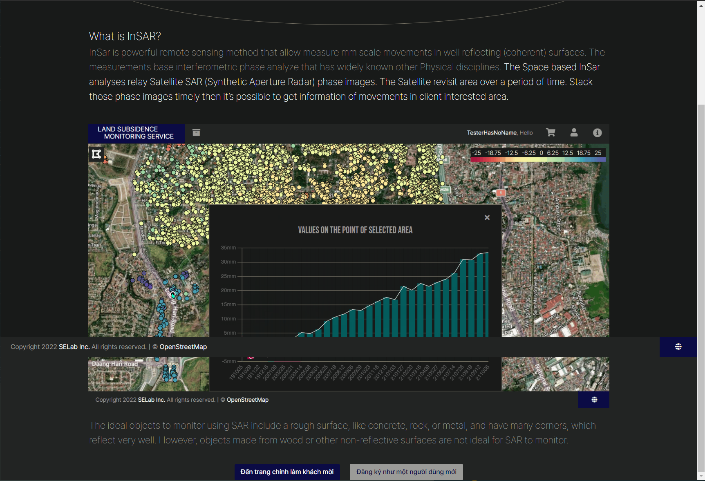
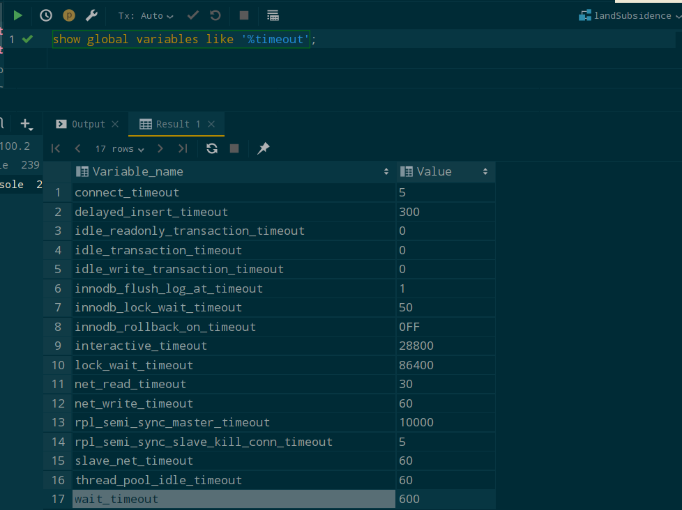

## 프로젝트 전반의 각종 이슈 해결 및 디버깅
`2022.04.12. - 2022.04.13.`

## Introduction
지반침하모니터링 서비스 프로젝트 2차 시연을 앞두고, 프로젝트 내부적인 각종 이슈를 해결하고 디버깅을 진행한다.

---

## Task
* [x] Failed to decode downloaded font 이슈 해결
* [x] 결제 내역 상태 변경 시 NullPointerException 발생 이슈 해결
* [x] footer 포지셔닝 이슈 해결
* [x] newCachedThreadPool 이슈 해결
* [x] Hikari-CP pool-size 이슈 해결
* [x] 배포시 페이지 매핑 불가능한 이슈 해결

---

## Details
### Task #1
**OTS parsing error: Failed to convert WOFF 2.0 font to SFNT / Failed to decode downloaded font 이슈 해결**  
프로젝트 개발 과정에서, view단과 관련된 작업을 전혀 수행하지 않았음에도 불구하고 갑작스럽게 화면 내 아이콘(font-awesome)들이 
깨져서 나오는 현상이 발견되었다. Webhook, Jenkins, k8s, ArgoCD를 통해 실서버에 배포된 해당 프로젝트에는 동일한 이슈가 
발생하지 않았고, 같은 팀원의 로컬에서도 발생하지 않은 이슈였다.  

브라우저 내에서 개발자 모드를 열어 console 화면을 확인했을 때, 다음과 같이 warning이 표출되었다:  

  

문제 원인은 `maven-resources-plugin`에 의해 font 파일들이 필터링 되었기 때문으로, `pom.xml` 내에 해당 폰트 포맷들을 
`nonFilteredFileExtensions` 태그 내에 입력 해 주면 된다.  

```xml
<plugin>
    <groupId>org.apache.maven.plugins</groupId>
    <artifactId>maven-resources-plugin</artifactId>
    <configuration>
        <nonFilteredFileExtensions>
            <nonFilteredFileExtension>eot</nonFilteredFileExtension>
            <nonFilteredFileExtension>svg</nonFilteredFileExtension>
            <nonFilteredFileExtension>ttf</nonFilteredFileExtension>
            <nonFilteredFileExtension>woff</nonFilteredFileExtension>
            <nonFilteredFileExtension>woff2</nonFilteredFileExtension>
        </nonFilteredFileExtensions>
    </configuration>
</plugin>
```

---

### Task #2
**결제 내역 상태 변경 시 NullPointerException 발생 이슈 해결**  
프로젝트 프로세스 상 사용자가 선택한 영역 및 그에 대한 기한을 설정하고 결정을 진행하면 해당 요청은 `REQUESTED` 상태로 설정된다. 
이후, 관리자가 해당 요청 건의 유효 여부를 1차적으로 확인하고 요청의 승인/거부 여부를 설정한다. 
요청의 승인/거부 여부는 form 내 radio button input의 onchange 이벤트를 통해 핸들링된다.

```js
const acceptWithRadio = document.getElementById("acceptRadio");
acceptWithRadio.onclick=()=>{
    if(acceptWithRadio.checked) {
        ...
    }
}
```

onchange 이벤트를 통해 요청의 승인/거부를 판별한 뒤 새로운 상태, 즉 `IN_PROGRESS` / `NOT_AVAILABLE`이 대입되는데 
간헐적으로 새로운 상태값이 들어오지 않아 확인 해 보니 원인은 단순했다. 
상태를 승인하는 라디오 버튼에 기본값 checked가 대입되어 있어 사용자가 그 어느 radio 버튼도 클릭하지 않는 경우에는 
onchange 조건이 충족되지 않으므로 null이 대입된 것.  

```html
<input type="radio" class="inline checkbox" name="isAccepted" id="acceptRadio" value="true" checked>
<label th:text="#{admin.ok}" th:attr="for='isAccepted" style="cursor: pointer"> </label>
```
해결 방안은 단순하게, value를 기본값으로 대입해 주면 해결된다.  
```html
<input type="hidden" name="newStatus" th:id="'newStatus' + ${paidData.id}" value="IN_PROGRESS"/>
```

---

### Task #3
**footer 포지셔닝 이슈 해결**  
기본적으로 footer는 사용자 영역 범위 내 최하단에 위치하도록 `position: absolute, position: block` 설정되어 있으나, 
본문의 내용이 창 영역(100vh)를 넘어가는 경우 스크롤을 내리면 아래 이미지와 같이 화면 중간에 어정쩡하게 걸리는 이슈가 존재했다:  
  

position: fixed로 바꿔주면 바로 해결된다.  

  

---

### Task #4
**newCachedThreadPool 이슈 해결**  
기존 알림 발송 메소드에서 SSE 이벤트를 발송하기 위한 executor는 `newCachedThreadPool`로써, 이는 요청이 발생할 때마다 
새로운 thread를 생성하여 pool에 추가하는 방식이다. 단, 재사용이 가능한 경우에는 이전에 구성한 thread를 재사용하고, 
60초 동안 사용되지 않은 thread는 종료한 후 cache로부터 제거한다. 하지만 사용 가능한 thread가 존재하지 않는 경우 
thread를 새로 생성하기 때문에 서버가 자주 로드되어 많은 작업을 수행해야 하는 경우 많은 thread가 생성되어
문제가 악화될 가능성이 있다. 이번에 프로젝트를 진행하면서 만나게 된 이슈도 바로 이 문제로, 
`newCachedThreadPool`로 인해 발생한 것이었다. 

즉, SSE 이벤트 발송 및 초기화 구문 등의 로직 처리에서 모든 페이지가 sseEventListener를 
들고 있으므로, 수많은 thread를 생성하고 닫는 로직을 반복하고 있었던 것이다.

또한, SSE의 경우 timeout이 일어나기 전까지 단 1건의 이벤트도 발생하지 않는다면 503 에러를 발생시키는 로직을
자체적으로 가지고 있어 이를 위한 초기화, 즉 SSE 연결 즉시 1건의 dummy 이벤트를 발생시키도록 initializeSSE 메소드를
작성하여 사용하고 있었으나 해당 메소드 역시 불필요한 thread 생성을 유발하고 있었다.

기존 코드는 다음과 같다:  

```java
private final ExecutorService executor = Executors.newCachedThreadPool();

@GetMapping(value = "/notification", produces = "text/event-stream")
public ResponseEntity<SseEmitter> doNotify(
        HttpServletRequest httpRequest, StatusChangeRequest request) throws Exception{
    notificationService.notifyAndSaveChangedStatus(httpRequest,request);
    return new ResponseEntity<>(initializeSSE(),HttpStatus.OK);
}
```

이에 따라,`newCachedThreadPool`을 `newSingleThreadPool`로 변경하고, SseEmitter의 timeout 설정을 
`Long.MAX_VALUE`로 설정하여 해당 이슈를 피하도록 했다.  
수정 후 각 SSE 발송 구문이 요청당 1횠기 수행되고 있음을 확인할 수 있었다.  

변경된 코드는 다음과 같다:  
```java
public static Map<Long, SseEmitter> sseEmitters = new ConcurrentHashMap<>();
private final ExecutorService executor = Executors.newSingleThreadExecutor();

@GetMapping(value = "/notification", produces = "text/event-stream")
public ResponseEntity<SseEmitter> doNotify(
        HttpServletRequest httpRequest, StatusChangeRequest request) throws Exception {
    final SseEmitter emitter = new SseEmitter(Long.MAX_VALUE);
    notificationService.addEmitter(emitter);
    
    emitter.onCompletion(() -> notificationService.removeEmitter(emitter));
    emitter.onTimeout(() -> notificationService.removeEmitter(emitter));
    return new ResponseEntity<>(emitter, HttpStatus.OK);
}
```

---

### Task #5
**Hikari-CP timeout : pool-size 이슈 해결**  
로컬 서버, 실 서버 양측에서 간헐적으로 발생하는 Hikari-CP 이슈로 인해 약 2주 간을 팀원과 함께 삽질해 왔다. 
우선 해결을 위해 시도해 보았던 것들은 다음과 같았다:  
1. Hikari-CP timeout 이슈가 발생하는 connection 누수 지점의 확인
2. 주된 누수 지점으로 꼽힌 SSE 이벤트 발생 구문에 자원 반납 코드 추가
3. 또한 SSE 관련 로직 전반을 리팩토링 하여 불필요한 connection/thread 생성 수 감소 조치
4. 불필요한 Transaction이 발생하는 곳은 없는지 확인 후 백엔드 로직 전반 리팩토링

그럼에도 불구하고 이슈는 계속 발생했는데... 로컬 서버도 그렇지만 실서버에서 로그인 조차 정상적으로 실행이 되지 
않았다. SSE 로직 전반을 리팩토링하고 `newCachedThreadPool`을 `newSingleThreadPool`로 변경하는 등 SSE로 
인해 발생하는 thread 생성 수를 대폭 감소시켜 로그인까지는 Hikari-CP timeout이 발생하지 않게 되었지만, 
결제 내역의 신규 생성 과정에서 또 해당 문제가 발생한 것이다. 시나리오 상 해당 이슈가 발생하는 지점은 DB 트랜젝션이 
발생하는 부분이었기에 더 이상했다. 분명히 staging/dev 모두 DB상 문제는 존재하지 않는 것처럼 보였기 때문에.  

구글링하는 과정에서 그 이유를 알게 되었다. 
HikariCP는 `maxLifetime`에 도달한 connection의 연결을 끊고 새로운 connection을 생성하는 방식이다. 
그리고 MySQL은 기본적으로 자신에게 맺어진 connection 중 일정 시간 이상 사용하지 않은 connection을 종료하는 프로세스가 존재한다.
HikariCP의 `maxLifetime`이 MySQL의 `wait_timeout`보다 짧다면 이러한 문제는 발생하지 않으며, 
단! Hikari-CP의 maxLifetime은 "사용하지 않는" connection으로 한정된다.

기본적으로는 **MySQL의 wait_timeout의 기본 값은 default 28800 seconds / 8시간**, 
**HikariCP의 기본 값은 600000 milliseconds / 10분**으로 
기본 설정값 기준 이러한 문제가 발생하지 않는 것이 정상이다.

이 이슈를 해결하기 위해 시도해 보았던 것들은 적절했다. SSE 관련 로직에 자원 반납 코드를 추가하고, 프로젝트 전반의 connection / 
thread / transaction 수를 감소시키는 등의 조치를 취했다. 문제가 계속 발생했던 것은 삽질을 통해 `application.properties` 내에 
작성한 설정이 수정되지 않았기 때문이었다.  

기존 설정은 다음과 같았다:  

```properties
spring.datasource.hikari.maximum-pool-size=20
spring.datasource.hikari.connection-timeout=30000
spring.datasource.hikari.idle-timeout=600000
spring.datasource.hikari.max-lifetime=1800000
```

그런데! 연결된 MySQL DB의 timeout 설정을 확인해 보니 결과는 이러했다:  

  

**wait_timeout의 값이 600. 즉 10분이었다!**  
여기서 다시 한 번 뭐라고? HikariCP의 maxLifetime은 반드시 MySQL의 wait_timeout보다 짧아야 한다.  
그런데 설정된 MySQL의 wait_timeout이 10분, HikariCP의 maxLifetime이 30분. HikariCP의 설정이 MySQL의 설정보다 확연히 길다.  

문제를 해결했을 때는 설정을 다음과 같이 잡았다:  

```properties
spring.datasource.hikari.maximum-pool-size=100
spring.datasource.hikari.connection-timeout=3000
spring.datasource.hikari.idle-timeout=10000
spring.datasource.hikari.max-lifetime=420000
```

**변경된 HikariCP의 maxLifetime은 42만 milliseconds로, 7분이다.**  
그리고 기존 MySQL의 wait_timeout은 10분으로, MySQL의 wait_timeout이 HikariCP의 maxLifetime보다 짧아, 
HikariCP의 timeout을 발생시키지 않는 조건을 충족한다!  

---

### Task #6
**배포시 페이지 매핑 불가능한 이슈 해결**  
정말 귀신이 곡할 노릇의 이슈가 나타났다. 로컬 서버에서는 전혀 존재하지 않았던 문제인데, 이상하게 배포된 실서버에서만 특정 페이지들을 
찾을 수 없는 문제였다. 에러 메세지는 `Template might not exist or might not be accessible by any of the configured Template Resolvers`로, 
멀쩡히 존재하고 있는 페이지를 로드하는데에 실패했으며, HttpStatus 500 에러가 발생하였다. 당시 사내에서 Kubernetes를 대입한 초기였기 때문에 
배포 과정에서 발생한 이슈라고 판단해 Webhook, Jenkins, Docker, Kubernetes 등 모든 배포 과정을 재검토하고 확인해 보았으나 문제를 찾을 수 없었다.  

리서칭을 통해 찾아낸 문제의 원인은 정말 예상도 못 한 이슈였다:  

jar 파일로 배포된 프로젝트의 classpath는 `public/`, `resources/`, `static/`, `templates/`, `META-INF/**`, `*` 로,
`templates` 경로 뒤에 자동으로 `/`가 붙은 classpath가 기본적인 설정이라는 것이다. 따라서, `spring.thymeleaf.prefix=classpath:/templates`와 
같이 별도로 classpath prefix를 잡아주지 않는 이상은 모든 HTML 파일을 `templates/` prefix에 프로젝트 내에 선언한 경로를 붙여 찾게 된다.  

즉, Controller 내 매핑 경로를 다음과 같이 `/index`로 설정했다면:  
```java
@PostMapping("/login")
public String login(@Valid @ModelAttribute LoginRequest loginRequest) {
    Authentication authentication = authenticationManager.authenticate(
            new UsernamePasswordAuthenticationToken(loginRequest.getEmail(), loginRequest.getPassword()));
    SecurityContextHolder.getContext().setAuthentication(authentication);
    return "/index";
}
```

로컬 서버에서는`templates/index`로 HTML 파일을 찾게 되니 문제가 발생하지 않지만,  
**실 서버에서는 `templates//index` 로 prefix `templates/` + `/index`가 되어 해당 파일을 찾을 수 없게 된다!**  

삽질한 시간에 비해 해결은 아주 쉽게, Controller 내 선언한 모든 template HTML 파일의 반환 경로에서 `/`를 제외하고,  
```java
@PostMapping("/login")
public String login(@Valid @ModelAttribute LoginRequest loginRequest) {
        ...
    return "index";
}
```
...와 같이 작성해 주면 문제가 해결된다.  
로컬 서버에서도, 실서버에서도 페이지를 찾아 오는데 지장이 없다.  
문제의 원인은 아주 단순했지만, jar 파일의 기본 classpath prefix 설정에 대한 부분을 새롭게 알게 되어 좋은 공부가 되었다.

## Remark

---

## Reference
[Spring Boot Font 배포 에러](https://shortstories.gitbooks.io/studybook/content/spring_boot_font_bc30_d3ec_c5d0_b7ec.html)  
[Apache Maven Project - Filtering](https://maven.apache.org/plugins/maven-resources-plugin/examples/filter.html)  
[Spring Boot 2.x 에서 HikariCP 문제점 해결](https://blog.miyam.net/100)  
[HikariCP와 커넥션 누수(Connection Leak) 관련 트러블슈팅](https://do-study.tistory.com/97)  
[디비 커넥션 누수 개선 사항 (Hikari Pool)](https://cmelcmel.tistory.com/111)  
[hikariCP mysql 접속 끊김 질문입니다](https://www.inflearn.com/questions/98336)  
[template might not exist or might not be accessible by any of the configured Template Resolvers](https://myserena.tistory.com/155)

---
