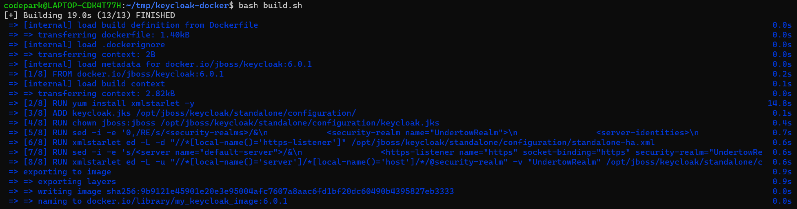
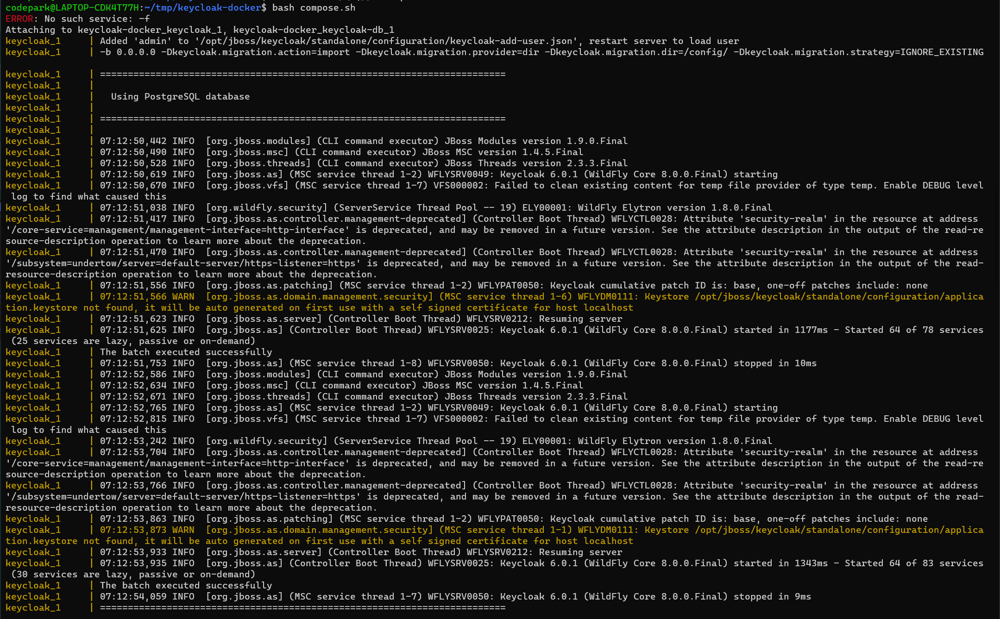
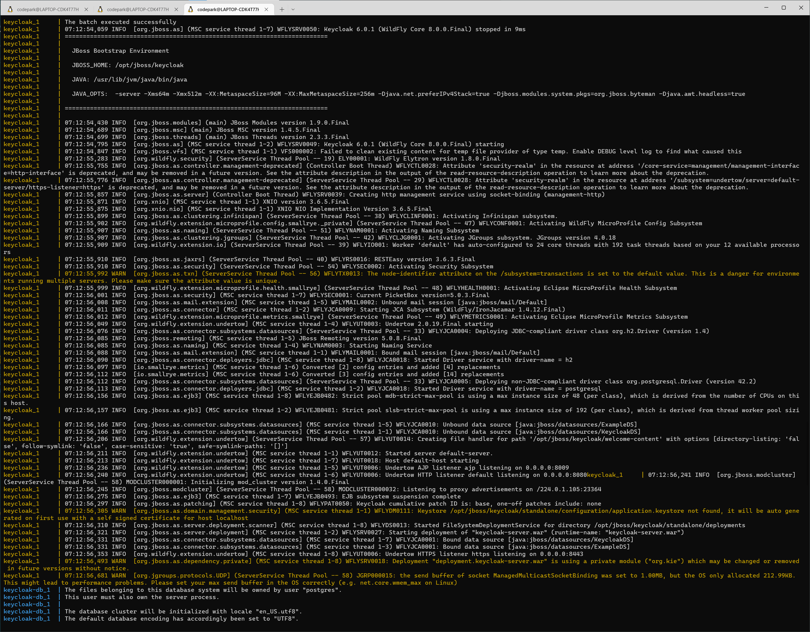
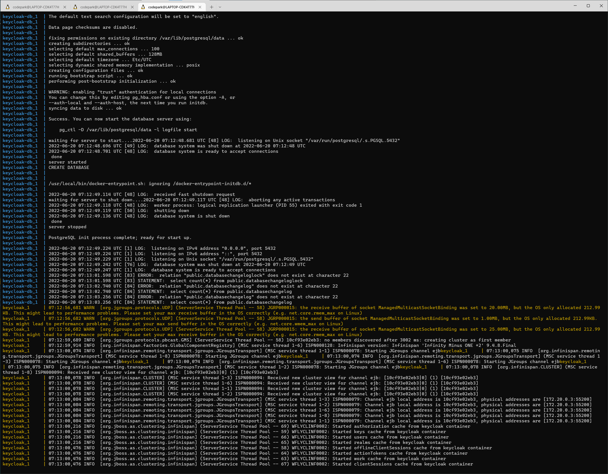
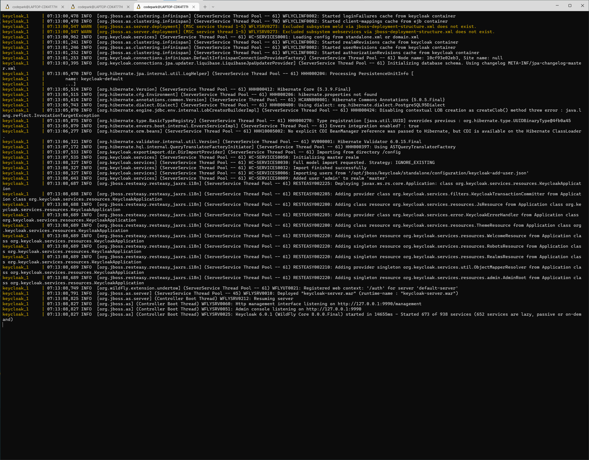
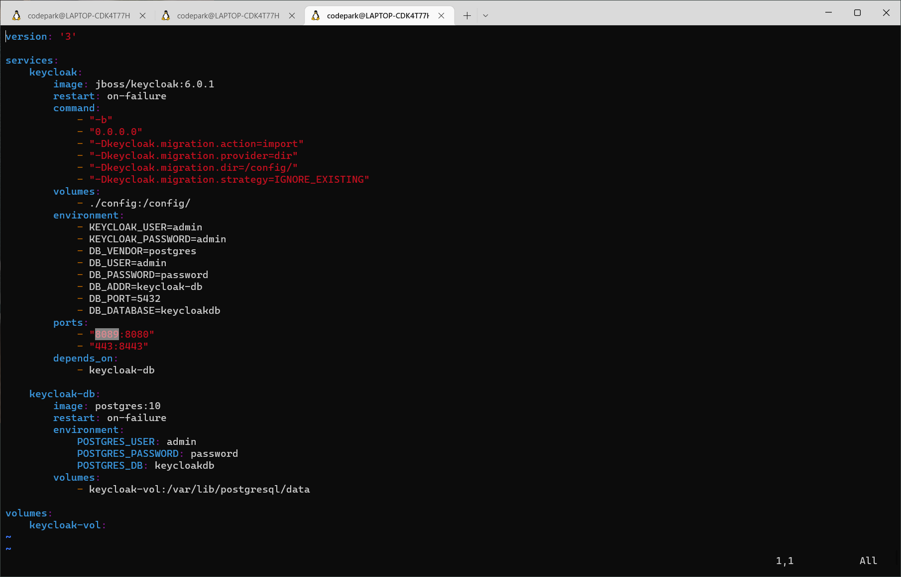
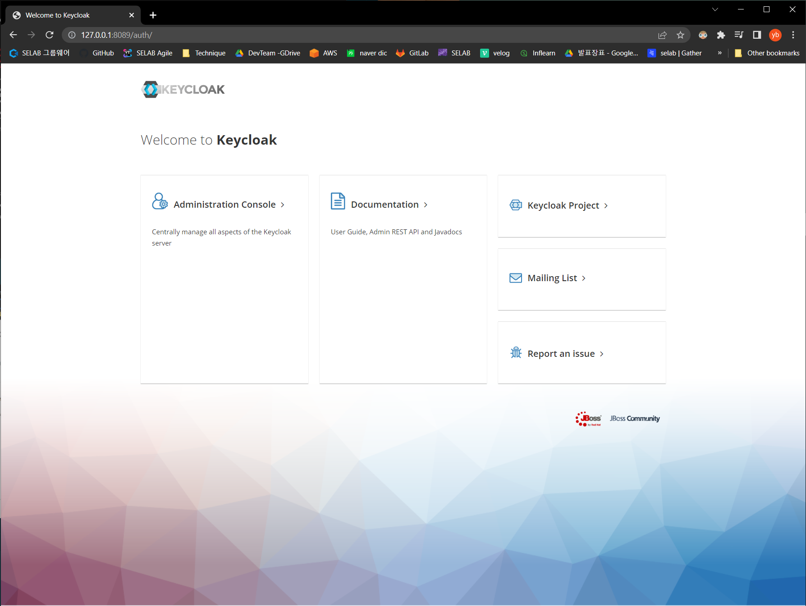
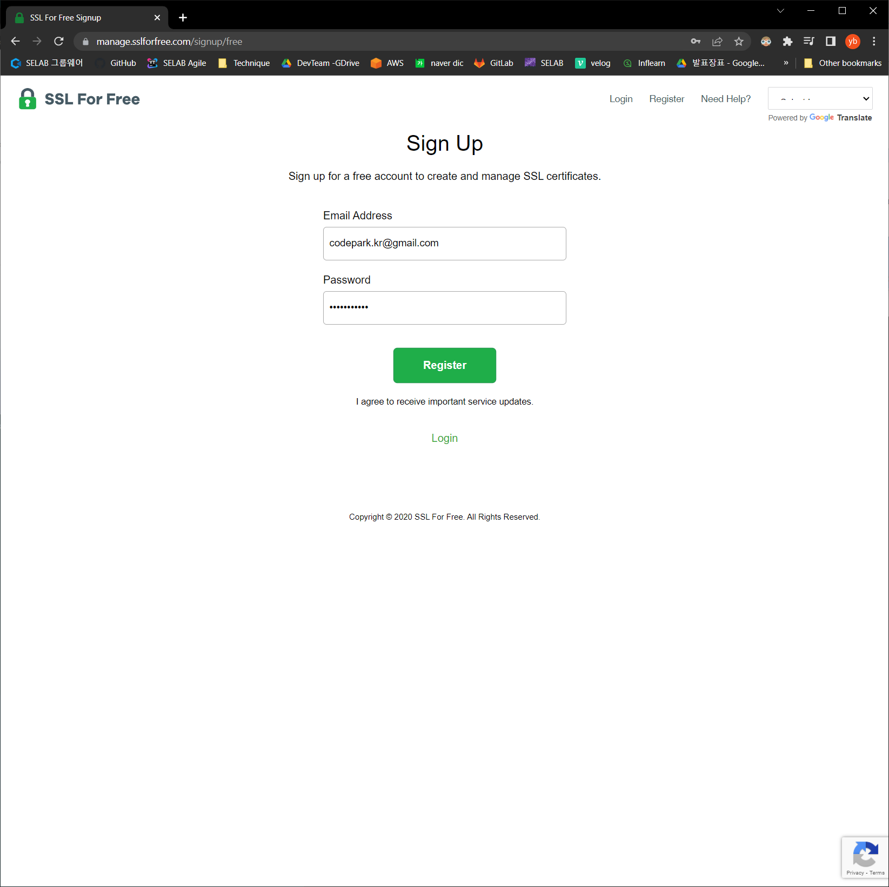
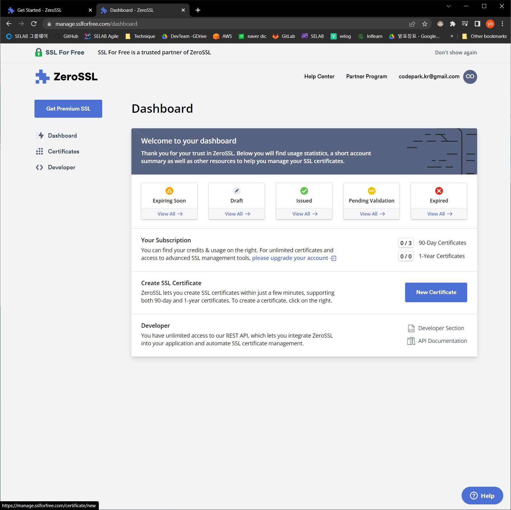
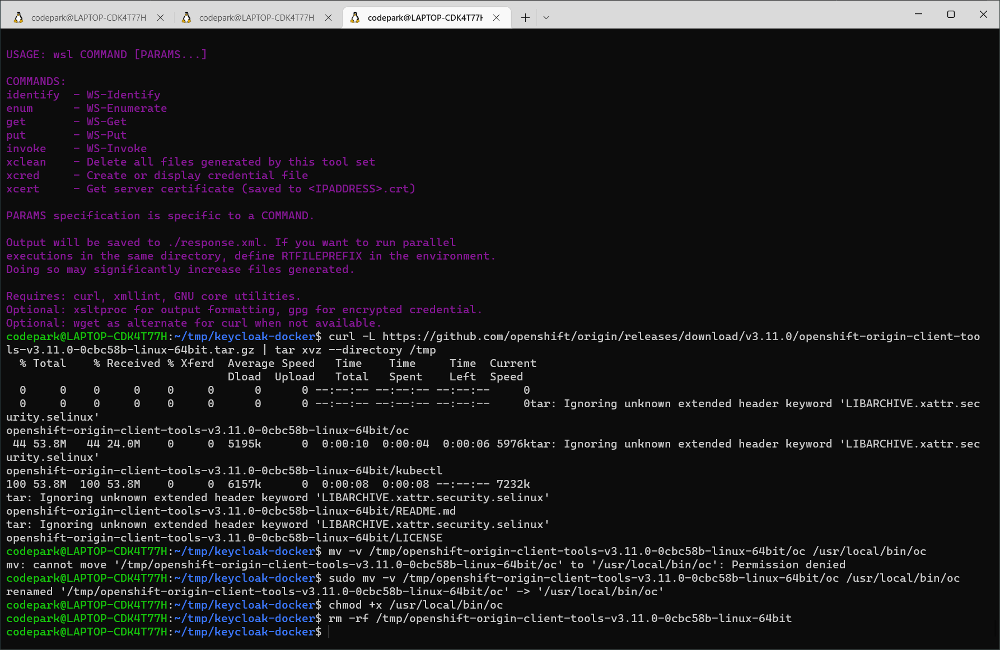

## OpenVPN Community Edition + LDAP + Keycloak
`2022.05.27. - `

## Introduction
사내 인프라 개선 프로젝트의 일부로, OpenVPN Community Edition + LDAP + Keycloak을 연동하고, 사용자 계정 생성 및 권한 설정을 부여한다. 

---

## Task
* [x] Keycloak 기본 설정
* [x] LDAP + Keycloak
* [ ] k8s + docker compose + keycloak 기초 설정

---

## Details

### Task #1 Keycloak 기본 설정


Groups / Role Mappings :
1.	Default-roles-demo : assign the roles by default.
2.	Offline-access : e.g. periodic backup of some data
3.	Uma-authorization : User-management-Access authorization (usually it’s for admin)

* Usually the application save the offline tokens into database usually also using it to manually retreive new access token
* from keycloak server. Also, the offline token will never expire and is not subject of SSO Session Idle timeout. 
* The offline token is valid even after a user logout or server restart. However by default, 
* the user do need to use the offline token for a refresh token action at least once per 30 days.
* (= by the setting : Offline Session Idle timeout – it can be changed in the administration console in the tokens -)

1-1.	Install Keycloak  
`wget https://github.com/keycloak/keycloak/releases/download/17.0.1/keycloak-17.0.1.tar.gz`  

1-2.	Unzip keycloak  
`tar -zxf keycloak-17.0.1.tar.gz`  

1-3.	Install Open JDK 11  
`sudo apt install openjdk-11-jre-headless`  

1-4.	Fix resolv.conf  
`sudo vi /etc/resolv.conf`  
change the nameserver configuration to -> `nameserver 8.8.8.8`  
`sudo apt update`  
`java -version`  

1-5.	Configure hostname of keycloak  
`cd ~/keycloak-17.0.1/conf`  
`vi keycloak.conf`  
add configuration as follows:
```
hostname-strict=false  
hostname-strict-https=false  
http-enabled=true  
http-port=5010
```  

1-6.	Start Keycloak  
`cd ~/keycloak-17.0.1/`  
`bin/kc.sh start`  

1-7.	Create an initial admin user  
`selabdev / password`  

1-8.	Build with postgres  
`bin/kc.sh build --db postgres`  

1-9.	Configure connection information with postgres  
```
http-relative-path=/auth
db=postgres
db-username=postgres
db-password=password
db-url=jdbc:postgresql://localhost:5432/postgres
```  

1-10.	Install Postgresql  

1-11.	Add configs for DNS  
`sudo vi /etc/network/interfaces`  
add `dns-nameservers 8.8.8.8 8.8.4.4`  
`sudo vi /etc/resolv.conf`  
```
nameserver 8.8.8.8
nameserver 8.8.4.4
```  
`sudo apt update`  
`sudo apt install postgresql postgresql-contrib`  

1-12.	Change access information for postgres  
`sudo find / -name pg_hba.conf`  
`cd /etc/postgresql/10/main/`  
`sudo vi pg_hba.conf`  
change to local connections to `trust` from `md5/peer`  
  

1-13.	Check the connection of postgres  
`service postgresql status`  
`sudo service postgresql stop`  
`sudo service postgresql start`  

1-14.	Create new server with postgresql
  
  
  


1-15.	Create new db withb postgres  
  

1-16.	Execute psql  
```
sudo service postgresql start
sudo -u postgres psql
postgres=# \l
```  

  


1-17.	Restart Keycloak with postgres
  
  

---

### Task #2 LDAP + KeyCloak

2-1.	Install LDAP
```
sudo apt update
sudo apt install slapd ldap-utils
```  
set up the development environment with this ref:  
https://medium.com/analytics-vidhya/install-openldap-with-phpldapadmin-on-ubuntu-9e56e57f741e

2-2.	Configure the openLDAP server post installation  
`sudo dpkg-reconfigure slapd`  

2-3.	Configure LDAP clients  
`sudo vi /etc/ldap/ldap.conf`  
add to :  
```
TLS_REQCERT allow
BASE dc=selab,dc=cloud
URI ldap://localhost
```

2-4.	Test the server  
```
sudo service slapd status
sudo service slapd start
ldapsearch -x
```
2-5.	Check output  
  

2-6.	Install phpldapadmin  
`sudo apt install phpldapadmin`  

2-7.	Configure phpldapadmin  
`sudo vi /etc/phpldapadmin/config.php`  

2-8.	Set the timezone accordingly  
(find word with vim : type to ? { KEYWORD })  
modify to `config->custom->appearance[‘timezone’] = ‘Asia/Seoul’;`  
```
servers->setValue('server','name',’{ CUSTOM-SERVERNAME }’)
servers->setValue('server','host',’{ CUSTOM IP ADDRESS }’);
config->custom->appearance['hide_template_warning'] = true;
servers->setValue('login','anon_bind',false);
```

2-9.	Generate new User Federation with Keycloak
  
  

---

### Task #3: RSA + phpldapadmin

3-1. Install OpenVPN plugin for LDAP authentication  
`sudo apt install openvpn-auth-ldap`    

3-2. Install Easy-RSA dependecies  
```
wget https://github.com/OpenVPN/easy-rsa/archive/3.0.1.tar.gz
tar xzvf 3.0.1.tar.gz
rm 3.0.1.tar.gz
```

3-3. Customize the easy-RSA Configuration  
```
cd easy-rsa-3.0.1/easyrsa3
cp vars.example vars
echo 'set_var EASYRSA_DN "org"' >> vars
echo 'set_var EASYRSA_KEY_SIZE 4096' >> vars
echo 'set_var EASYRSA_REQ_COUNTRY "DE"' >> vars
echo 'set_var EASYRSA_REQ_PROVINCE "Berlin"' >> vars
echo 'set_var EASYRSA_REQ_CITY "Berlin"' >> vars
echo 'set_var EASYRSA_REQ_ORG "BigchainDB GmbH"' >> vars
echo 'set_var EASYRSA_REQ_OU "IT"' >> vars
echo 'set_var EASYRSA_REQ_EMAIL "dev@bigchaindb.com"' >> vars
```

3-4. Disable firewall   
`sudo ufw allow proto tcp from any to any port 80,443`

3-5. Generate dn, objectClass, ou for LDAP  
`sudo vim basedn.ldif`
```java
dn: ou=people,dc=selab,dc=cloud
objectClass: organizationalUnit
ou: people

dn: ou=groups,dc=selab,dc=cloud
objectClass: organizationalUnit
ou: groups
```

3-6. Apply the configuration  
`sudo ldapadd -x -D cn=admin,dc=selab,dc=cloud -W -f basedn.ldif`

3-7. Start the apache2  
`sudo service apache2 start`  

3-8. Check the phpldapadmin on http://localhost/phpldapadmin/
  

3-9. Create new ou(Organization Units) in phpldapadmin  
click to `Create new entry here` -> Select `Generic : Organization Unit`  

  
Then fill up the form - Alias for new organization unit.  

---

### Task #3 k8s + docker compose + keycloak 기초 설정  

1. Create new directory as tmp, clone the repository : keycloak-docker(unofficial)  
```shell
mkdir tmp
git clone https://github.com/maslick/keycloak-docker
```
2.  Filter sh file with regex and transform for linux  
```shell
sed -i -e 's/\r$//' ssl.sh
sed -i -e 's/\r$//' build.sh
sed -i -e 's/\r$//' compose.sh
```
3. Installation : execute sh files with bash  
```shell
bash ssl.sh
bash build.sh
bash compose.sh
```
result(full logs) :  
  
  
  
  
  

4. Run keycloak  
Check out the default-server config, port number from `docker-compose.yml`
  

Access to keycloak console  
path : `https://{localhost:port}/auth`  


*Default password admin:admin can be changed in docker-compose.yml: KEYCLOAK_USER, KEYCLOAK_PASSWORD*  

5. Get free certificate from [SSL for free](https://www.sslforfree.com/)  
Register first :  
  

Then Click to new Certificate(for 90-days)  

get : 
```shell
* ca_bundle.crt (root and intermediate certificates)
* certificate.crt (public key)
* private.key (private key)
```

Create a java keystore (jks) from files acquired in step 1  
```shell
// combine letsencrypt certificate with the issued certificate
cat certificate.crt ca_bundle.crt > fullchain.pem

// convert to PKCS12 store
openssl pkcs12 -export -in fullchain.pem -inkey private.key -name auth.maslick.com -out fullchain_plus_key.p12 -password pass:secret

// convert to java keystore
keytool -importkeystore -deststorepass secret -destkeypass secret -destkeystore keycloak.jks -srckeystore fullchain_plus_key.p12 -srcstoretype PKCS12 -srcstorepass secret
```

6. Install Openshift 
```shell
curl -L https://github.com/openshift/origin/releases/download/v3.11.0/openshift-origin-client-tools-v3.11.0-0cbc58b-linux-64bit.tar.gz | tar xvz --directory /tmp
mv -v /tmp/openshift-origin-client-tools-v3.11.0-0cbc58b-linux-64bit/oc /usr/local/bin/oc
chmod +x /usr/local/bin/oc
rm -rf /tmp/openshift-origin-client-tools-v3.11.0-0cbc58b-linux-64bit
```
  


---

## Remark


---

## Reference
[Redhat OpenShift - Configuring project creation - OFFICIAL ](https://docs.openshift.com/container-platform/4.6/applications/projects/configuring-project-creation.html)  
[Running Openshift 3.11 inside WSL2](https://gist.github.com/kekru/f14c0a5d05db4f2f1a3cd92bdaa6a4d0)  
[keycloak installation with docker - OFFICIAL](https://www.keycloak.org/docs/latest/server_installation/index.html#enabling-ssl-https-for-the-keycloak-server)  
[maslick/keycloak-docker](https://github.com/maslick/keycloak-docker)  
[Keycloak(User Federation) - LDAP 연계](https://hs-note.tistory.com/23)  
[$'\r': command not found 쉘 실행 시 에러 나는 경우](https://isuetracker.tistory.com/770)  
[Linux>기본명령어>sed](http://www.incodom.kr/Linux/%EA%B8%B0%EB%B3%B8%EB%AA%85%EB%A0%B9%EC%96%B4/sed)


---
