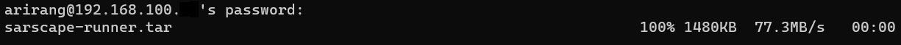
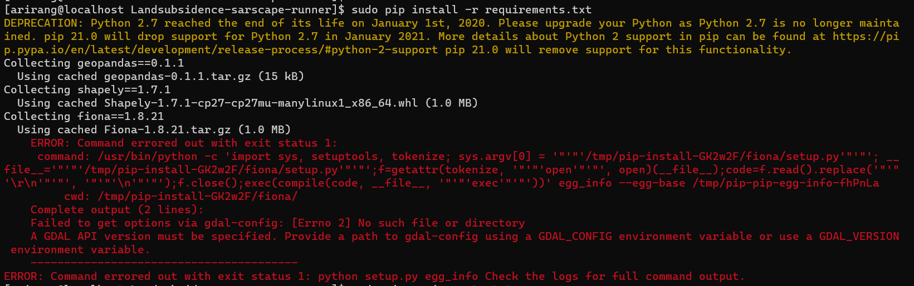
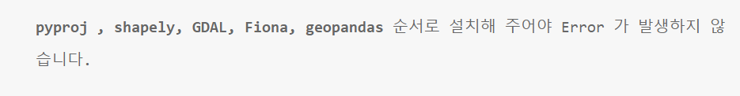

## SARscape-runner 프로세스 dockerfile 생성
`2022.06.09. - `

## Introduction
지반침하모니터링 서비스의 위성 영상 다운로드, 클라이언트 API 호출 등을 위한 python 기반의 
repository에 dockerfile 작성 및 docker image를 생성한다.

---

## Task
* [x] 사용하지 않는 구버전의 파일들 정리
* [ ] Dockerfile 작성 후 image 생성
* [ ] 정상적인 docker image 생성 확인

---

## Details

### Task #1 사용하지 않는 구버전의 파일들 정리
본격적으로 dockerfile을 생성하기 전에, 해당 repository에 git이 적용되기 이전 시점 해당 파일의 사본을 
생성하는 형식으로 버전 관리를 해 왔기 때문에 구 버전의 파일들을 정리하고자 한다. 현 시점 사내에서 사용하고 
있는 Pycharm은 trial 버전이기 때문에, 보다 직관적인 내부 파일 확인을 위해 ssh로부터 해당 repo를 압축하고, 
로컬로 가져오기로 한다.  

### 1-1. Compress folder to tar file in CentOS
`tar -cvf [COMPRESSED-FILE-NAME.EXT] [TARGET-FOLDER-NAME]`  
e.g. `tar -cvf sarscape-runner.tar LandSubsidence-sarscape-runner/`  

### 1-2. Copy file from ssh remote-server to local directory  
`scp [ACCESS-ID]@[IPv4-ADDRESS]:[TARGET-FILE-PATH + FILE-NAME] [DESTINATION]`  
e.g. `scp arirang@192.168.100.0:/data/arirang/subsidence/script/sarscape-runner.tar C:\Users\codep\Downloads`

### 1-3. Fix requirements.txt
dockerfile을 작성하기 위해, 각 개별 커맨드를 직접 실행해 보고 모든 라인이 정상적으로 작동하는지 테스트 해 보았다.  
아니나 다를까, `pip install -r requirements.txt` 라인에서 에러가 발생하는 것을 확인 할 수 있었다.  

  

요약하면 의존성 fiona를 설치하기 위해 GDAL 변수를 필요로 하며 이 것을 찾을 수 없다는 이슈로 보이는데,  
먼저 첫 번째 해결 방법으로 꼽히는 것은 아래와 같았다:  

(WIp)

