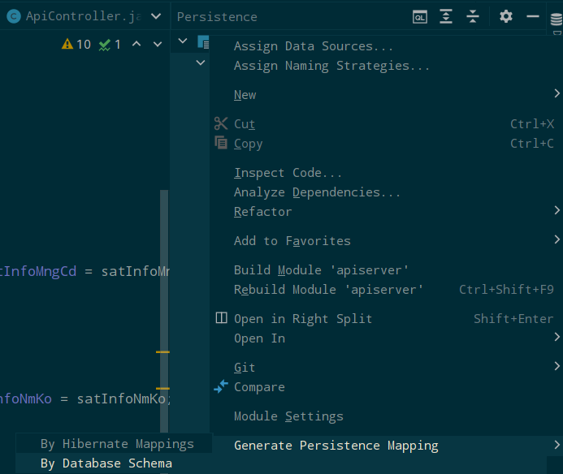

## JPQL Native Query, Criteria Builder
`2022.06.21-2022.06.28.`

## Introduction
해양 오염 분석 프로젝트의 일부로, Optional 조건에 따른 위성 영상 기본 정보 조회 및 미분석 모델 구동을 위한 API를 설계하고, 생성한다.  

## Task
* [x] 스프링 부트 기반 경량 API 서버 환경 신규 구축
* [x] 위성 영상 기본 데이터와 오염 정보 시퀀스 간 차집합을 구한 후 복수의 건으로 반환하는 기반 API 생성
* [x] 복수의 시퀀스 결과값을 파싱한 후 파싱된 결과물을 파라미터로 전달하여 API를 호출하는 로직의 작성
* [x] 위성 기본 정보 조회 API의 신규 생성
* [x] Swagger 기초 설정 작성
* [x] ArgoCD workflow와 구현된 API의 연동
* [x] 미분석 모델의 재구동을 위한 로직의 대상을 Satellite-1 기준으로 한정
* [x] 기존 미분석 모델의 조회 로직을 max-index 기반으로 추출 후 1회 트랜젝션 로직으로 변경

---

### Task #1 위성 영상 기본 데이터와 오염 정보 시퀀스 간 차집합을 구한 후 복수의 건으로 반환하는 기반 API 생성
위성 기본 정보 - 오염 정보 간 시퀀스의 차집합을 구하는 API 신규 생성을 위해, 우선 Entity를 우선적으로 생성한다. 
대상이 되는 테이블은 기본적으로 2종, 1. 위성 기본 정보에 해당하는 객체와 2. 1의 위성 정보의 분석 결과, 즉 탐지된 오염 정보를 가지고 있는 테이블이다. 
다수의 컬럼을 가지고 있는 테이블의 경우, 1차적으로 빠른 생성을 위해 IntelliJ 내 Persistence 메뉴를 통해 자동 생성 해 준다.


  
생성은 Persistence -> Generate Persistence Mapping -> By Database Schema 메뉴를 선택하면 된다.  
Persistence 메뉴의 사용을 위해서는, 물론 일차적으로 해당 Database를 IntelliJ상으로 매핑해야 한다.  

여기서 주의할 점은, IntelliJ Persistence 메뉴를 통한 entity 자동 생성은 컬럼명을 다음과 같이 기본 선언한다:  
```java
private String useYn;
...
@Basic
@Column(name = "use_yn")
public String getUseYn() { return useYn; }
public void setUseYn(String useYn) { this.useYn = useYn; }
```
위의 코드를 보면 `@Column` annotation의 선언 위치가 getter 메소드 위에 붙어있는 것을 확인 할 수 있는데, 
이는 native query가 아닌 JPQL 형식으로 쿼리를 작성하는 경우 해당 컬럼에 대응되는 올바른 변수명을 찾을 수 없는 문제를 야기한다.  
즉: Repository에 다음과 같은 형식으로 JPQL을 작성하는 경우 :  

```java
    @Query(value = "select b.useYn from SatelliteBaseInfo b")
    List<String> findAllUseYn();
```

`useYn` 이라는 `private String useYn`이라는 변수를 찾을 수 없다는 에러가 발생하게 되는 것이다.  
이에 따라, 해당 annotation의 위치를 적절하게 바꿔주어야 한다. 다음과 같이 :  
```java
@Column(name = "useYn") // annotation의 위치를 변수명 윗 라인으로 바꿔준다.
private String useYn;

public String getUseYn() { return useYn; }
public void setUseYn(String useYn) { this.useYn = useYn; }
```

Entity 생성, Repository 생성이 완료되면 Service, ServiceImpl을 순차적으로 작성한다. 
구현 대상인 로직은 위성 기본 정보 테이블의 시퀀스, 즉 PK Id로부터 오염 정보(분석 결과) 테이블의 시퀀스 간 차집합을 구하는 것이므로, 
우선 2회의 트랜젝션이 발생할 것을 염두하고 각 시퀀스 만을 단순 조회한 후 이들의 차집합을 stream을 통해 필터링 하기로 한다.  

**BaseInfoRepository (위성 기본 정보 Repository)**
```java
    @Query(value = "select b.satImgSeq from SatellitelBaseInfo b")
    List<Long> findAllIds();
```

**PollutionRepository (오염 정보 Repository)**
```java
    @Query(value = "select p.satImgSeq from PollutionInfo p")
    List<Long> findAllIds();
```

**SatelliteServiceImpl**
```java
@Override
public List<Long> findAllDirty() {
    List<Long> origin = baseInfoRepository.findAllIds();
    List<Long> analyzed = pollutionRepository.findAllIds();
    return origin.stream()
        .sorted()
        .filter(e -> !analyzed.contains(e))
        .collect(Collectors.toList());
}
```

---

### Task #2 복수의 시퀀스 결과값을 파싱한 후 파싱된 결과물을 파라미터로 전달하여 API를 호출하는 로직의 작성
상기한 Task #1에서 `Collectors.toList()`를 통해 생성된 Long 타입의 배열의 내부 값 시퀀스를 하나씩 파라미터로 전달하기 위해, 
다음과 같은 호출 로직을 우선적으로 작성한다 : 

**Controller**  
```java
@PostMapping("/satellite/dirty")
public void callApiForDirtyModels() {
    satelliteService.findAllDirty().forEach(e -> satelliteService.callApi(e));
}
```

stream + Collectors.toList()를 통해 List<Long>의 형식으로 필터링된 시퀀스를 담고 있는 배열을, 
forEach(파싱된 각 내부 단수값 당 -> 실행 메소드(개별 내부 단수값 전달)); 의 형식으로 간단히 메소드를 호출할 수 있다.  

여기서 호출될 실행 메소드란 바로 API 호출을 위한 Http 통신 구조일 것이다.  
직접 코드를 작성하는 경우에는 1차적으로 다음과 같은 로직을 생성할 수 있겠다:  

```java
@Override
public void callApi(Long sequence) {
    try{
        URL url = new URL("http://localhost:11000/api/call?sequence="+sequence.toString());
        HttpURLConnection conn = (HttpURLConnection) url.openConnection();
        setConnectionProperty(conn, type);
        BufferedWriter bw = new BufferedWriter(new OutputStreamWriter(conn.getOutputStream()));
        
        bw.flush();
        bw.close();
        
        int responseCode = conn.getResponseCode();
        if(responseCode == 200) { log.info("The process has been succeeded. => " + sequence); }
    } catch(Exception e) { log.error("Exception has been occurred : => " + e); }
}

public HttpURLConnection setConnectionProperty(HttpURLConnection conn, String type) {
    try {
        conn.setRequestMethod("POST");
        conn.setRequestProperty("Content-Type", "application/json");
        conn.setRequestProperty("Transfer-Encoding", "chunked");
        conn.setRequestProperty("Connection", "keep-alive");
        conn.setDoOutput(true);
    } catch (ProtocolException e) {
        log.error("ProtocolException has been occurred : " + e);
    }
    return conn;
}
```

Request 타입에 대한 재사용 가능성이 없는 경우를 상정하고 POST 타입, no request body 형식으로 HTTP를 통해 
API를 호출하는 형식의 기본 로직이다. 파싱된 미분석 모델(List<Long> sequences)을 전달할 실서버의 API가 개발되기 이전이므로, 
우선 forEach 구문을 통해 전달받은 각 시퀀스 번호를 단순 반환만 하는 API를 생성하여 호출할 것을 감안하였다. 
시퀀스 단순 반환을 위한 API는 다음과 같이 작성했다 :  

```java
@GetMapping("/call")
public ResponseEntity<String> printSequence(@RequestParam Long sequence) {
    return ResponseEntity.ok().body(sequence.toString());
}
```

local 서버 호출 경로가 `http://localhost:11000`라고 할 때, 각 호출 URL의 예시는 다음과 같을 것이다 :   
e.g. `http://localhost:11000/api/call?sequence=53`  

---

### Task #3 위성 기본 정보 조회 API의 신규 생성
추가로, 위성 기본 정보를 조회하는 API를 신규로 생성한다. **단, 모든 파라미터는 Optional**이여야 하고, 그 어떤 파라미터도 전달되지 않을 경우 조회 기간 등을 한정하여야 한다. 전달될 인자의 목록은 다음과 같다 : 

1. [optional] postGIS 상 geometry 타입에 해당되는 geometry
2. [optional] 위성 센서명. 단, 현 시점 서울대 모델에 한정되어야 한다. 즉 `S1_`의 형식으로 제한할 것.
3. [optional] 조회 시작일
4. [optional] 조회 종료일

반환될 결과값은 `satellite_base_info` 객체로, json 형식이어야 한다.

1차적으로는 단순 조회에 해당되는 간단한 API지만, 모든 파라미터가 Optional이기 때문에 로직상 적절한 구현 방식에 대해 고민이 되었다. 
가장 무식한 방법으로는, JpaRepository<Long, SatelliteBaseInfo>를 상속한 JPA repository에서 각 조건에 해당되는 메소드 형식의 조회문을 복수 생성하고, 
조건문을 태워 적절한 메소드를 통해 질의 하는 방법이 있다. 단, 이 방식의 구현은 쉽고 단순하지만 모든 경우의 수에 해당되는(즉, 비효율적으로 많은 수의) JPA 메소드와 조건문을 선언해야 한다는 단점이 있다. 때문에 보류. 

둘 째로는, QueryDSL을 활용한 동적 쿼리를 생성하는 방법이 있다. 
하지만 현 시점 이 프로젝트는 스프링 부트 기반의 **"경량"** API 서버를 구축하는 데에 초점이 맞춰져 있으므로 가급적 스프링 부트 자체 지원 기능을 
활용하고자 했다. 이 역시 보류.

세 번째 방법은 CriteriaBuilder, Specification을 활용한 방법으로, 객체 지향 쿼리를 생성하는 JPA 자체 라이브러리를 통하는 것이다.  
예를 들면 다음과 같다 :  


**SatelliteServiceImpl**
```java
public Specification<SatBaseInfo> getBaseInfoByOptionalCondition(SatBaseInfoRequest request) {
    List<Predicate> predicates = new ArrayList<>();
    return (root, query, criteriaBuilder) -> {
        if(request.getSensorName() != null) {
            predicates.add(criteriaBuilder.equal(root.get("satImgSnsrNm"), request.getSensorName()));
        }
        if(request.getStartDate() != null && request.getEndDate() != null) {
            predicates.add(criteriaBuilder.between(root.get("satImgShtDt"),
            stringToLocalDateTime(request.getStartDate()), stringToLocalDateTime(request.getEndDate())));
        }
        if(request.getGeometry() != null){
            predicates.add(criteriaBuilder.equal(root.get("geom"), request.getGeometry()));
        }
        return criteriaBuilder.and(predicates.toArray(new Predicate[0]));
    };
}
...
```
위와 같은 로직의 처리 순서는 다음과 같다 :  
1. 사용자 요청값을 담고 있는 request DTO로부터 위성 촬영 센서명 값이 존재하면 criteriaBuilder(척도-builder)에 equals 조건문을 추가한다.
2. request DTO로부터 startDate/endDate 값이 존재하면 위성 촬영 일자가 사용자 요청값 startDate 및 endDate의 between 조건문을 추가한다.
3. request DTO로부터 geometry 값이 존재하면 geometry equals 조건문을 추가한다.

즉, 4종 - sensorName, startDate, endDate, geometry 값을 사용자로부터 받으나, 이 4가지 파라미터 모두 optional 변수이다.
값이 존재하게 되면 해당 값에 해당되는 조건문을 추가하고, 

**Repository - SpecificationExecutor**  
```java
public interface SpecificSatelliteRepository extends JpaRepository<SatBaseInfo, Long>, JpaSpecificationExecutor<SatBaseInfo> {
}
```

**SatelliteServiceImpl**  
```java
@Override
public List<SatBaseInfo> getSatBaseInfo(SatBaseInfoRequest request) {
    return specificSatelliteRepository.findAll(getBaseInfoByOptionalCondition(request));
}
```

생성했던 SpecificationExecutor repository의 findAll에 인자로 생성된 Specification<SatBaseInfo>를 전달하면 된다.  

---