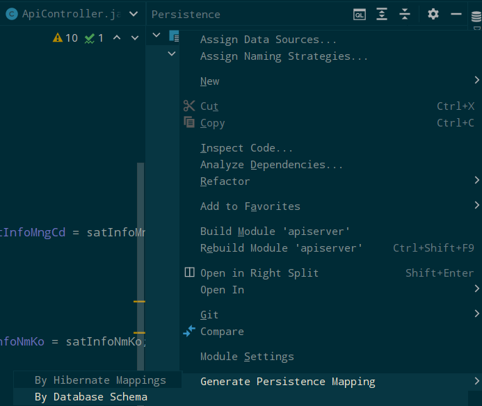

[Rough]

### 작업 
신규 할당된 해양화학기술원 위성 조회 및 모델 구동 API 신규 개발  

### 작업 상세
1. 전달받은 논리, 물리 ERD 내용 숙지하여 서울대에서 제공하는 자료 기반 Sentinel-1-A/B에 해당하는 데이터 분석  
2. 전 위성 이미지의 seq : 다운로드가 완료된 위성 이미지의 차집합을 구한 뒤 위성 이미지 다운로드가 실행되지 않은 데이터의 seq/sentinel a/b 여부를 복수의 건으로 반환할 수 있도록 할 것 (1차)  
3. 2의 결과건을 받아 해당 데이터의 seq를 param으로 전달하여 argoCD를 통해 생성된 url을 호출하는 API 신규 생성
4. 위의 프로세스는 cron-job을 통해 주기적으로 실행되도록 할 것

### 특이사항
해당 API의 목적은 위성 조회 및 모델 구동을 위한, 즉 일종의 bridge-process 수행을 위한 것임.  
사용자 결과값 표출을 위한 것이 아니기 때문에 개발자 시점 식별 가능한 형식으로 로깅/결과 실행이 최우선임을 숙지할 것.

### 선행 조건
사내 인프라 개선 프로젝트의 일부로, 기존 web example template의 infra+ci/cd 설정을 기반으로 한 **경량 API 서버 기반 탬플릿을 
신규로 생성**하고, 팀에 해당 내용 공유 및 전달할 수 있도록 할 것.  

### Task 
* [x] \#1 프로젝트 저장소 기반을 설정하고, 위성 기본 정보와 오염 정보 시퀀스의 차집합을 구하는 기초 API를 구현한다.  
* [x] 

### Detail
프로젝트 초기 설정 및 위성 기본 정보 - 오염 정보 간 시퀀스의 차집합을 구하는 API 신규 생성을 위해, 우선 Entity를 우선적으로 생성한다. 
대상이 되는 테이블은 기본적으로 2종, 1. 위성 기본 정보에 해당하는 객체와 2. 1의 위성 정보의 분석 결과, 탐지된 오염 정보를 가지고 있는 테이블이다. 
다수의 컬럼을 가지고 있는 테이블의 경우, 1차적으로 빠른 생성을 위해 IntelliJ 내 Persistence 메뉴를 통해 자동 생성 해 준다.


  
생성은 Persistence -> Generate Persistence Mapping -> By Database Schema 메뉴를 선택하면 된다.  
Persistence 메뉴의 사용을 위해서는, 물론 일차적으로 해당 Database를 IntelliJ상으로 매핑해야 한다.  

여기서 주의할 점은, IntelliJ Persistence 메뉴를 통한 entity 자동 생성은 컬럼명을 다음과 같이 기본 선언한다:  
```java
private String useYn;
...
@Basic
@Column(name = "use_yn")
public String getUseYn() { return useYn; }
public void setUseYn(String useYn) { this.useYn = useYn; }
```

(WIP)